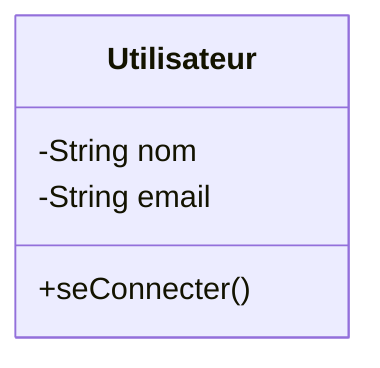

# 01 - Introduction à UML

## C'est quoi UML ?

**UML** (Unified Modeling Language) est un langage de modélisation graphique normalisé. Il sert à **représenter visuellement** la structure et le comportement d'un système, surtout en génie logiciel (mais pas seulement).

Ce n'est **pas** un langage de programmation : on ne "compile" pas un diagramme UML. C'est un outil de communication et de conception.

## Pourquoi utiliser UML ?

- Communiquer une architecture entre développeurs, ou avec des non-techniques
- Concevoir avant de coder (réfléchir à la structure)
- Documenter un système existant
- Faciliter la maintenance (comprendre rapidement un système)

## Les deux grandes familles de diagrammes

UML compte 14 types de diagrammes officiels, regroupés en deux catégories :

### 1. Diagrammes structurels (statiques)
Ils décrivent **l'organisation** du système, ses éléments et leurs relations.

| Diagramme | Utilité |
|---|---|
| Classes | Structure du code (classes, attributs, méthodes, relations) |
| Objets | Instance du diagramme de classes à un instant T |
| Composants | Organisation en modules/composants logiciels |
| Déploiement | Répartition physique (serveurs, machines) |
| Paquetages | Organisation en packages/dossiers |

### 2. Diagrammes comportementaux (dynamiques)
Ils décrivent **le comportement** du système au fil du temps.

| Diagramme | Utilité |
|---|---|
| Cas d'utilisation | Fonctionnalités vues par les utilisateurs |
| Séquence | Échanges de messages dans le temps |
| Activité | Flux/algorithme, enchaînement d'actions |
| États | Cycle de vie d'un objet (états successifs) |

> 👉 Dans ce repo, on se concentre sur les diagrammes les **plus utilisés en pratique** : Classes, Séquence, Cas d'utilisation, Activité, États, et un aperçu de Composants/Déploiement.

## Quand utiliser quel diagramme ?

- Je veux montrer **la structure du code** → Diagramme de classes
- Je veux montrer **ce qu'un utilisateur peut faire** → Diagramme de cas d'utilisation
- Je veux montrer **comment des objets interagissent dans le temps** → Diagramme de séquence
- Je veux montrer **un algorithme / processus métier** → Diagramme d'activité
- Je veux montrer **les états possibles d'un objet** → Diagramme d'états

## Exemple ultra simple (diagramme de classes en Mermaid)

On reverra ça en détail au chapitre 2.

## À retenir

- UML = langage de modélisation, pas de programmation
- 2 familles : structurel (statique) vs comportemental (dynamique)
- Le bon diagramme dépend de **ce que tu veux montrer**, pas de l'inverse
