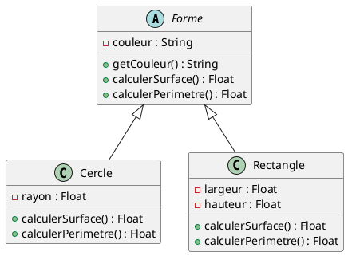
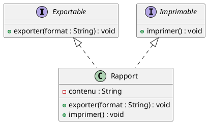
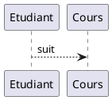
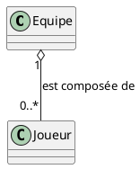
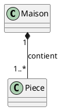
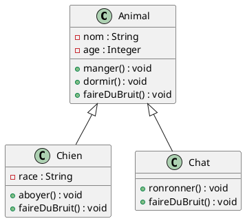
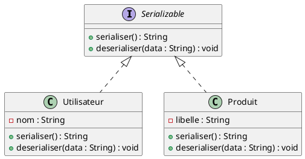
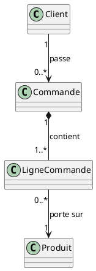
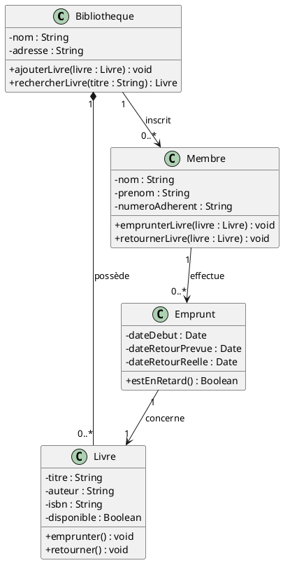

# 02 - Diagramme de classes

Le diagramme le plus utilisé en UML. Il décrit la **structure statique** d'un système : les classes, leurs attributs, leurs méthodes, et les relations entre elles.

## Objectifs pédagogiques

- Savoir lire et écrire un diagramme de classes
- Distinguer les 5 types de relations et savoir choisir le bon
- Identifier les classes, attributs et méthodes à partir d'un énoncé texte
- Comprendre et placer les cardinalités correctement

---

## 1. Anatomie d'une classe

Une classe se représente par un rectangle divisé en **3 compartiments** :

```
┌─────────────────────────┐
│       NomClasse         │  ← (1) Nom de la classe
├─────────────────────────┤
│ - attribut1 : Type      │  ← (2) Attributs = les données
│ + attribut2 : Type      │
├─────────────────────────┤
│ + methode1() : Type     │  ← (3) Méthodes = les comportements
│ - methode2(param : Type)│
└─────────────────────────┘
```

### (1) Le nom de la classe

- Toujours en **PascalCase** : `Client`, `CommandeClient`, `LigneDeCommande`
- Représente un concept du domaine métier (pas une action)
- Doit être **au singulier** : `Produit` (pas `Produits`)

### (2) Les attributs

Un attribut représente une **donnée** portée par la classe. Chaque instance (objet) aura ses propres valeurs.

Syntaxe : `visibilité nom : Type = valeurParDéfaut`

Exemples :
```
- nom : String
- age : Integer = 0
+ email : String
# solde : Float
```

**Types courants :**

| Type | Signification | Exemple |
|------|---------------|---------|
| `String` | Chaîne de caractères | `"Alice"` |
| `Integer` ou `Int` | Nombre entier | `42` |
| `Float` ou `Double` | Nombre décimal | `3.14` |
| `Boolean` | Vrai ou faux | `true` |
| `Date` | Date | `2024-01-15` |

### (3) Les méthodes

Une méthode représente un **comportement** de la classe. Elle peut recevoir des paramètres et retourner une valeur.

Syntaxe : `visibilité nom(param : Type) : TypeRetour`

Exemples :
```
+ calculerTotal() : Float
+ ajouterProduit(p : Produit) : void
- verifierStock(quantite : Integer) : Boolean
```

- `void` = la méthode ne retourne rien
- Les paramètres sont entre parenthèses
- Le type de retour est après les `:`

### Visibilité des membres

| Symbole | Nom | Accès depuis |
|---------|-----|--------------|
| `+` | public | n'importe où |
| `-` | private | la classe elle-même uniquement |
| `#` | protected | la classe et ses sous-classes |
| `~` | package | les classes du même package |

> **Bonne pratique :** les attributs sont presque toujours **privés** (`-`) pour protéger les données. Les méthodes destinées à l'extérieur sont **publiques** (`+`).

---

## 2. Classes spéciales

### Classe abstraite

Une classe abstraite est une classe **qu'on ne peut pas instancier directement** — on ne peut pas faire `new Forme()`. Elle sert uniquement de modèle à ses sous-classes.

**Pourquoi utiliser une classe abstraite ?**
- Pour définir un comportement commun à plusieurs classes
- Pour forcer les sous-classes à implémenter certaines méthodes
- Pour éviter la duplication de code

En PlantUML, on écrit `abstract class` :




**Remarques :**
- `Forme` est abstraite → on ne peut pas créer un objet `Forme` directement
- `Cercle` et `Rectangle` **héritent** de `Forme` et **doivent** implémenter `calculerSurface()` et `calculerPerimetre()`
- L'attribut `couleur` et la méthode `getCouleur()` sont hérités automatiquement par les deux sous-classes

### Interface

Une interface est un **contrat pur** : elle liste des méthodes sans aucune implémentation. Une classe qui "implémente" une interface s'engage à fournir **toutes** ses méthodes.

**Différence classe abstraite / interface :**

| | Classe abstraite | Interface |
|-|-----------------|-----------|
| Peut avoir des attributs | Oui | Non (ou seulement des constantes) |
| Peut avoir du code dans les méthodes | Oui | Non (en UML pur) |
| Une classe peut en hériter de | Une seule | Plusieurs |
| Représente | Un ancêtre commun | Un contrat / une capacité |



> `Rapport` implémente deux interfaces : il peut être exporté ET imprimé.

---

## 3. Les relations entre classes

C'est la partie la plus importante — et la plus piégée. Il faut choisir la **bonne relation** selon le lien réel entre les classes.

### 3.1 Association — lien simple

L'association est le lien **le plus général** : une classe "connaît" ou "utilise" une autre.



**Quand l'utiliser ?** Quand deux classes sont liées sans relation de possession ni d'héritage.

**Exemples du quotidien :**
- Un `Conducteur` conduit une `Voiture`
- Un `Medecin` soigne un `Patient`
- Un `Professeur` enseigne dans une `Classe`

### 3.2 Agrégation — "a un" (faible) ◇

L'agrégation exprime qu'une classe **contient** des instances d'une autre, mais ces instances peuvent **exister indépendamment**.



**Question clé :** "Si je supprime l'équipe, les joueurs existent-ils encore ?"
→ **Oui** → agrégation ◇

**Exemples du quotidien :**
- Une `Playlist` agrège des `Musique` (si on supprime la playlist, les musiques existent toujours)
- Une `Universite` agrège des `Etudiant` (si l'université ferme, les étudiants existent toujours)
- Un `Panier` agrège des `Produit`

### 3.3 Composition — "a un" (forte) ◆

La composition exprime qu'une classe **contient** des instances d'une autre, et ces instances **ne peuvent pas exister sans le tout**. Si le tout est détruit, les parties le sont aussi.



**Question clé :** "Si je supprime la maison, les pièces existent-elles encore ?"
→ **Non** → composition ◆

**Exemples du quotidien :**
- Une `Commande` est composée de `LigneCommande` (si la commande est supprimée, ses lignes disparaissent)
- Un `Document` est composé de `Paragraphe`
- Un `Formulaire` est composé de `ChampSaisie`

> **Astuce pour choisir entre agrégation et composition :**
> Pose la question : "La partie peut-elle exister sans le tout ?"
> - Oui → **agrégation** ◇
> - Non → **composition** ◆

### 3.4 Héritage / Généralisation — "est un"

L'héritage exprime qu'une classe **est une spécialisation** d'une autre. La classe fille hérite de **tous** les attributs et méthodes de la classe mère, et peut en ajouter d'autres.



**Remarques importantes :**
- `Chien` hérite de `nom`, `age`, `manger()`, `dormir()` → pas besoin de les réécrire
- `Chien` **redéfinit** `faireDuBruit()` (il aboie, pas l'animal générique)
- `Chien` **ajoute** `race` et `aboyer()` qui lui sont propres

**Exemples du quotidien :**
- `Voiture` et `Camion` sont des `Vehicule`
- `Administrateur` et `Moderateur` sont des `Utilisateur`
- `CompteCourant` et `CompteEpargne` sont des `CompteBancaire`

**Quand utiliser l'héritage ?** Uniquement si la relation "est un" est vraiment vraie. Un `Chien` EST un `Animal`. Mais une `Roue` n'est pas une `Voiture` → pas d'héritage.

### 3.5 Réalisation / Implémentation — "implémente"

Une classe implémente une interface : elle s'engage à fournir le code de toutes les méthodes définies par l'interface.



### Tableau récapitulatif des 5 relations

| Relation | Symbole | Question | Exemple |
|----------|---------|----------|---------|
| Association | `A --> B` | "A utilise B" | Conducteur → Voiture |
| Agrégation | `A o-- B` | "A a des B (qui survivent sans A)" | Playlist ◇ Musique |
| Composition | `A *-- B` | "A contient des B (qui meurent avec A)" | Commande ◆ LigneCommande |
| Héritage | `A <|-- B` | "B est un A" | Animal ← Chien |
| Réalisation | `A <|.. B` | "B implémente A" | Serializable ⇠ Utilisateur |

---

## 4. Les cardinalités (multiplicités)

Les cardinalités indiquent **combien d'instances** sont impliquées de chaque côté d'une relation.

| Notation | Signification | Exemple concret |
|----------|---------------|-----------------|
| `1` | Exactement un | Un emprunt concerne exactement 1 livre |
| `0..1` | Zéro ou un (optionnel) | Un employé a 0 ou 1 voiture de fonction |
| `*` ou `0..*` | Zéro ou plusieurs | Un client passe 0 ou plusieurs commandes |
| `1..*` | Un ou plusieurs (au moins un) | Une commande a au moins 1 ligne |
| `2..5` | Entre 2 et 5 | Une équipe a entre 2 et 5 joueurs |

### Comment lire une cardinalité ?

On lit **depuis l'autre bout** de la flèche :



Lecture :
- Du côté `Commande` on lit `0..*` → **un client passe zéro ou plusieurs commandes**
- Du côté `Client` on lit `1` → **chaque commande appartient à exactement un client**
- Du côté `LigneCommande` on lit `1..*` → **une commande contient au moins une ligne**
- Du côté `Produit` on lit `1` → **chaque ligne porte sur exactement un produit**

---

## 5. Comment identifier les classes à partir d'un texte

### Méthode en 4 étapes

**Étape 1 — Souligner les noms communs** → candidats à devenir des **classes**

**Étape 2 — Souligner les verbes** → candidats à devenir des **méthodes** ou des **associations**

**Étape 3 — Souligner les adjectifs et compléments** → candidats à devenir des **attributs**

**Étape 4 — Éliminer** les termes trop vagues, les doublons, les termes purement techniques

---

### Exemple guidé complet

**Énoncé :**
*"Une bibliothèque possède plusieurs livres. Chaque livre a un titre, un auteur et un ISBN. Un membre de la bibliothèque peut emprunter plusieurs livres. Un emprunt a une date de début et une date de retour prévue. Un membre a un nom, un prénom et un numéro d'adhérent."*

**Étape 1 — Noms communs (candidats classes) :**
`bibliothèque`, `livre`, `titre`, `auteur`, `ISBN`, `membre`, `emprunt`, `date`

**Étape 2 — Verbes (candidats relations/méthodes) :**
`possède` → relation Bibliothèque-Livre
`emprunter` → relation Membre-Livre, ou méthode

**Étape 3 — Attributs identifiés :**
- `Livre` : titre, auteur, ISBN
- `Membre` : nom, prénom, numéroAdherent
- `Emprunt` : dateDebut, dateRetourPrevue

**Étape 4 — Élimination :**
- `titre`, `auteur`, `ISBN`, `date` → pas des classes, ce sont des **attributs**
- `bibliothèque` → classe conservée

**Résultat :**




---

## 6. Erreurs classiques à éviter

| Erreur | Explication | Correction |
|--------|------------|------------|
| Nommer une classe avec un verbe (`Payer`) | Une classe = un concept, pas une action | Utiliser un nom : `Paiement` |
| Confondre agrégation et composition | La différence est la **durée de vie** des parties | Demander : "La partie survit-elle sans le tout ?" |
| Oublier les cardinalités | Elles sont **obligatoires** sur toutes les associations | Les ajouter systématiquement |
| Mettre tous les attributs en public | Viole l'**encapsulation** | Attributs en `-` (private), getters/setters en `+` |
| Créer une classe pour un simple attribut | `String` n'est pas une classe à modéliser | Un `String`, `Integer`, `Date`… reste un attribut |
| Héritage abusif | "Est-un" doit être **vraiment vrai** | Préférer la composition si le lien n'est pas naturel |
| Méthodes trop nombreuses | On ne modélise que les méthodes **importantes pour la conception** | Ne garder que celles qui ont un sens dans le contexte |

---

## À retenir

- 3 compartiments : **nom / attributs / méthodes**
- Attributs **privés** (`-`) par défaut → protège les données
- 5 relations : association, agrégation ◇, composition ◆, héritage, réalisation
- **Agrégation** : la partie survit sans le tout | **Composition** : la partie meurt avec le tout
- Cardinalités **obligatoires** sur toutes les associations
- Méthode pour identifier les classes : **noms** → classes, **verbes** → relations/méthodes, **adjectifs** → attributs
