# 02 - Diagramme de classes

Le diagramme le plus utilisé en UML. Il décrit la **structure statique** d'un système : les classes, leurs attributs, leurs méthodes, et les relations entre elles.

## Objectifs pédagogiques

- Savoir lire et écrire un diagramme de classes
- Distinguer les 5 types de relations
- Identifier les classes et leurs responsabilités à partir d'un énoncé
- Comprendre les cardinalités

---

## 1. Anatomie d'une classe

Une classe se représente par un rectangle à **3 compartiments** :

```
┌─────────────────────┐
│      NomClasse      │   ← nom de la classe (PascalCase)
├─────────────────────┤
│ - attribut1: Type   │   ← attributs (données)
│ + attribut2: Type   │
├─────────────────────┤
│ + methode1(): Type  │   ← méthodes (comportements)
│ - methode2(param)   │
└─────────────────────┘
```

### Visibilité des membres

| Symbole | Signification | Accès depuis |
|---------|---------------|--------------|
| `+` | public | n'importe où |
| `-` | private | la classe elle-même uniquement |
| `#` | protected | la classe et ses sous-classes |
| `~` | package | les classes du même package |

### Règle de nommage

- **Classe** : PascalCase (`CommandeClient`)
- **Attribut / méthode** : camelCase (`dateCommande`, `calculerTotal()`)
- **Constante** : SCREAMING_SNAKE_CASE (`TVA_TAUX`)

---

## 2. Classes spéciales

### Classe abstraite
Une classe abstraite **ne peut pas être instanciée directement** — elle sert de modèle à ses sous-classes. Son nom est en *italique* ou marqué `{abstract}`.

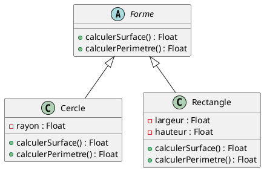

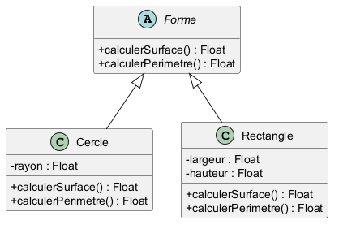

### Interface
Une interface définit un **contrat** (méthodes sans implémentation). Une classe qui "implémente" une interface s'engage à fournir toutes ses méthodes.

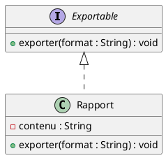

---

## 3. Les relations entre classes

C'est la partie la plus importante — et la plus piégée.

### 3.1 Association
Lien simple et générique entre deux classes ("utilise", "connaît", "est relié à").

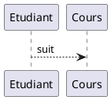

### 3.2 Agrégation (losange vide ◇)
Relation "a un" **faible** : les objets peuvent exister séparément. Si le tout disparaît, les parties survivent.

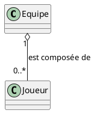
*Un joueur peut exister sans équipe (transfert, arrêt…).*

### 3.3 Composition (losange plein ◆)
Relation "a un" **forte** : la partie ne peut pas exister sans le tout. Si le tout est détruit, les parties le sont aussi.

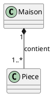
*Une pièce n'existe pas sans la maison.*

> **Astuce pour différencier agrégation et composition :**
> Pose-toi la question : "Si je supprime le tout, la partie a-t-elle encore un sens ?"
> - Oui → agrégation
> - Non → composition

### 3.4 Héritage / Généralisation (triangle vide)
Relation "est un". La classe fille hérite des attributs et méthodes de la classe mère.

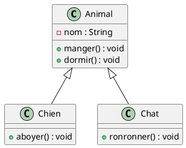

### 3.5 Réalisation / Implémentation (flèche pointillée)
Une classe implémente les méthodes définies par une interface.

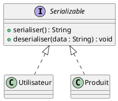

### Tableau récapitulatif

| Relation | PlantUML | Force du lien | Question clé |
|----------|----------|---------------|--------------|
| Association | `A --> B` | faible | "utilise" |
| Agrégation | `A o-- B` | moyenne | "a un" (survie indépendante) |
| Composition | `A *-- B` | forte | "est constitué de" (même durée de vie) |
| Héritage | `A <|-- B` | — | "est un" |
| Réalisation | `A <|.. B` | — | "implémente" |

---

## 4. Les cardinalités (multiplicités)

Elles se placent aux **extrémités** des relations et précisent combien d'instances sont impliquées.

| Notation | Signification |
|----------|---------------|
| `1` | exactement un |
| `0..1` | zéro ou un (optionnel) |
| `*` ou `0..*` | zéro ou plusieurs |
| `1..*` | un ou plusieurs (au moins un) |
| `n..m` | entre n et m |

### Exemple commenté

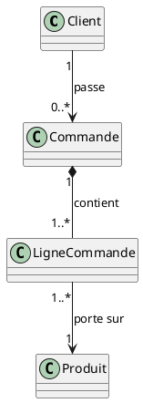

Lecture :
- Un client passe **zéro ou plusieurs** commandes.
- Une commande contient **au moins une** ligne de commande.
- Une ligne de commande porte sur **exactement un** produit.

---

## 5. Comment identifier les classes à partir d'un texte

### Méthode des noms communs

1. **Souligner les noms communs** dans l'énoncé → candidats à devenir des classes.
2. **Souligner les verbes** → candidats à devenir des méthodes ou des associations.
3. **Souligner les adjectifs** → candidats à devenir des attributs.
4. Éliminer les classes trop génériques ou les synonymes.

**Exemple :**
*"Un **client** peut passer plusieurs **commandes**. Chaque commande contient des **produits** avec une **quantité**."*

→ Classes identifiées : `Client`, `Commande`, `Produit`
→ Attribut candidat : `quantite` (sur la relation ou dans `LigneCommande`)
→ Relation : `Client` passe `Commande` ; `Commande` contient `Produit`

---

## 6. Exemple complet : système de bibliothèque

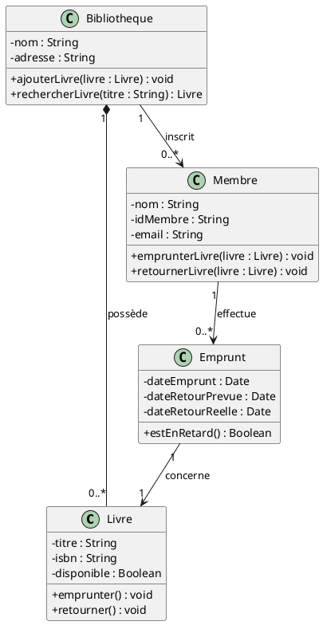

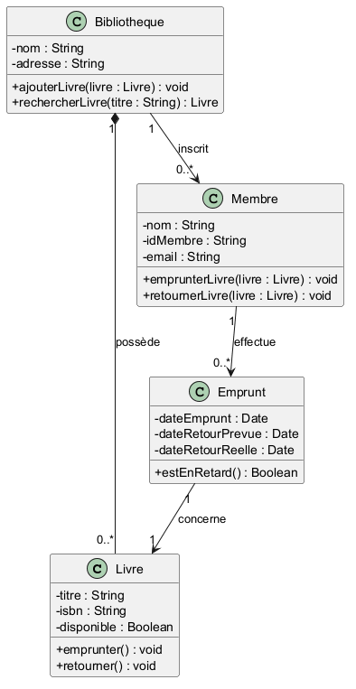

---

## 7. Erreurs classiques à éviter

| Erreur | Correction |
|--------|------------|
| Mettre des verbes comme nom de classe (`Payer`) | Les classes sont des **noms** (`Paiement`) |
| Confondre agrégation et composition | Demande-toi si la partie peut exister seule |
| Oublier les cardinalités | Elles sont **obligatoires** sur les associations |
| Mettre trop de méthodes | Ne garder que les méthodes **importantes pour la modélisation** |
| Créer une classe pour chaque attribut | Un attribut simple (String, int…) ne devient pas une classe |

---

## À retenir

- 3 compartiments : **nom / attributs / méthodes**
- 5 relations : association, agrégation, composition, héritage, réalisation
- Agrégation (◇) = faible | Composition (◆) = forte — c'est le **piège classique**
- Toujours indiquer les **cardinalités**
- Les noms communs d'un texte → candidats classes ; les verbes → relations ou méthodes
