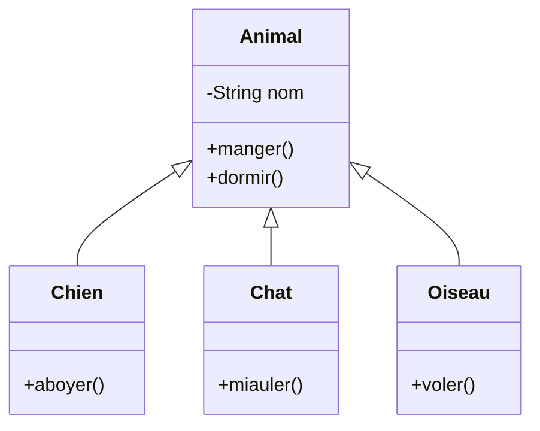
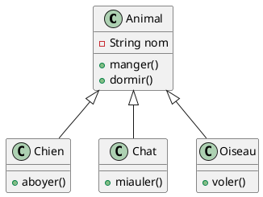

# Exemple : hiérarchie d'animaux (héritage)

## En Mermaid

```mermaid
classDiagram
    class Animal {
        -String nom
        +manger()
        +dormir()
    }
    class Chien {
        +aboyer()
    }
    class Chat {
        +miauler()
    }
    class Oiseau {
        +voler()
    }

    Animal <|-- Chien
    Animal <|-- Chat
    Animal <|-- Oiseau
```

## En PlantUML

```plantuml
@startuml
class Animal {
  -String nom
  +manger()
  +dormir()
}
class Chien {
  +aboyer()
}
class Chat {
  +miauler()
}
class Oiseau {
  +voler()
}

Animal <|-- Chien
Animal <|-- Chat
Animal <|-- Oiseau
@enduml
```
