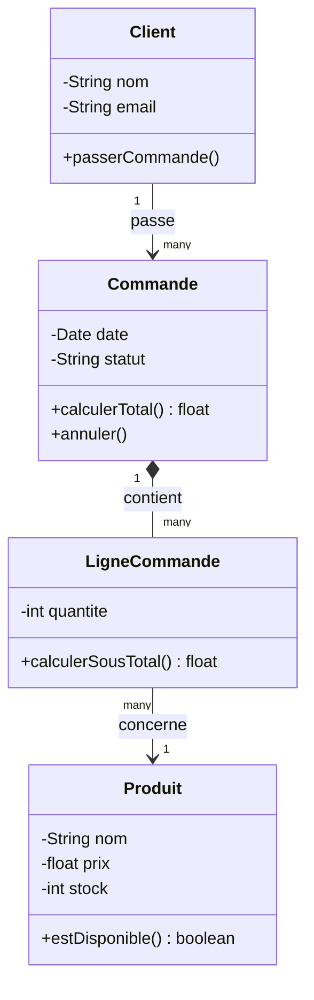

# Correction — Exercice 1

## Raisonnement

- **Client → Commande** : un client peut passer plusieurs commandes, mais une commande disparaît tout à fait normalement sans que le client disparaisse → **association simple** (pas de composition).
- **Commande → LigneCommande** : si la commande est supprimée, les lignes disparaissent → **composition** (losange plein).
- **LigneCommande → Produit** : la ligne référence un produit, mais si la ligne disparaît, le produit reste (il existe indépendamment, en stock) → **association simple**.

## Diagramme (Mermaid)

## Points clés à vérifier dans ta réponse

- ✅ Composition (et non agrégation) entre Commande et LigneCommande, car la dépendance de vie est forte
- ✅ Association simple entre LigneCommande et Produit, car le produit survit indépendamment
- ✅ Cardinalité `1 --> many` entre Client et Commande
- ✅ Attributs cohérents avec le métier (prix, stock, quantité, statut...)

Si tu avais mis une **agrégation** entre Commande et LigneCommande, ce n'est pas absurde mais c'est moins précis : la composition reflète mieux la règle métier donnée dans l'énoncé.
