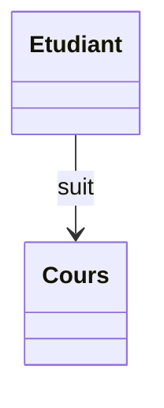
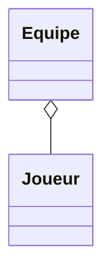
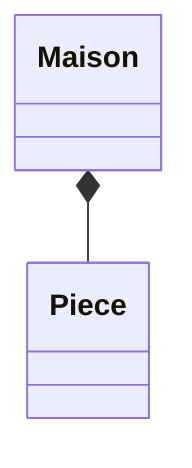
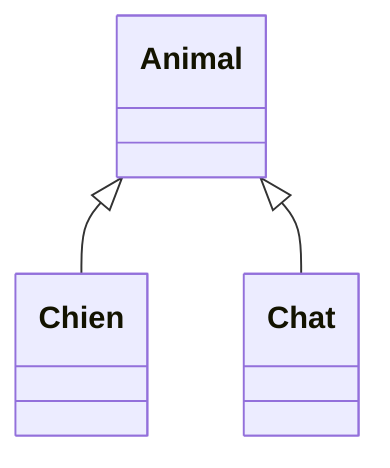
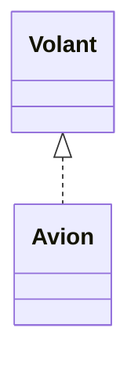
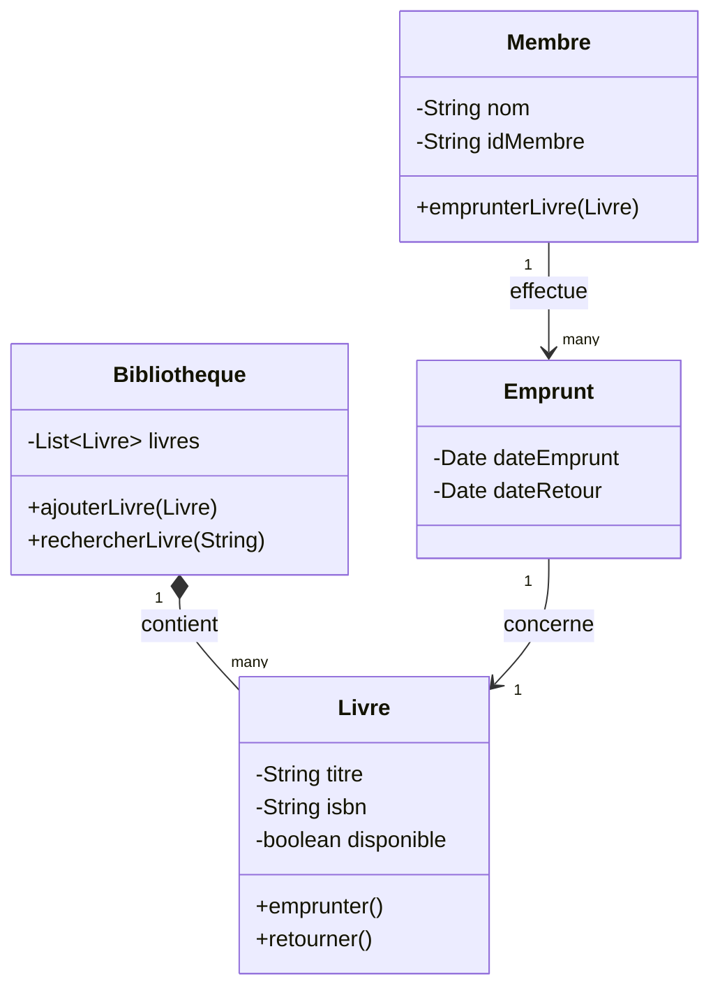

# 02 - Diagramme de classes

Le diagramme le plus utilisé en UML. Il décrit la **structure statique** d'un système : les classes, leurs attributs, leurs méthodes, et les relations entre elles.

## Anatomie d'une classe

Une classe se représente par un rectangle à 3 compartiments :

```
┌─────────────────────┐
│      NomClasse       │   ← nom de la classe
├─────────────────────┤
│ - attribut1: Type    │   ← attributs
│ + attribut2: Type    │
├─────────────────────┤
│ + methode1(): Type    │   ← méthodes
│ - methode2(param)     │
└─────────────────────┘
```

### Visibilité

| Symbole | Signification |
|---|---|
| `+` | public |
| `-` | private |
| `#` | protected |
| `~` | package |

## Les relations entre classes

C'est la partie la plus importante à maîtriser.

### 1. Association
Lien simple entre deux classes (« utilise », « connaît »).



### 2. Agrégation (losange vide)
Relation "a un", mais les objets peuvent exister indépendamment l'un de l'autre.


*Un joueur peut exister sans équipe.*

### 3. Composition (losange plein)
Relation "a un" forte : si le tout est détruit, les parties le sont aussi.


*Une pièce n'existe pas sans la maison.*

### 4. Héritage (généralisation)
Relation "est un". Flèche à triangle vide vers la classe mère.



### 5. Réalisation / Implémentation
Une classe implémente une interface.



### Tableau récapitulatif

| Relation | Symbole Mermaid | Sens |
|---|---|---|
| Association | `-->` | "utilise" |
| Agrégation | `o--` | "a un" (faible) |
| Composition | `*--` | "a un" (forte) |
| Héritage | `<|--` | "est un" |
| Réalisation | `<|..` | "implémente" |

## Exemple complet : système de bibliothèque



Le même exemple en PlantUML : voir [`exemples/bibliotheque.puml`](./exemples/bibliotheque.puml)

## Cardinalités (multiplicités)

| Notation | Signification |
|---|---|
| `1` | exactement un |
| `0..1` | zéro ou un |
| `*` ou `0..*` | zéro ou plusieurs |
| `1..*` | un ou plusieurs |
| `n..m` | entre n et m |

## À retenir

- 3 compartiments : nom / attributs / méthodes
- 5 relations clés : association, agrégation, composition, héritage, réalisation
- Bien distinguer agrégation (faible) vs composition (forte) — c'est le piège classique
- Toujours réfléchir aux cardinalités
