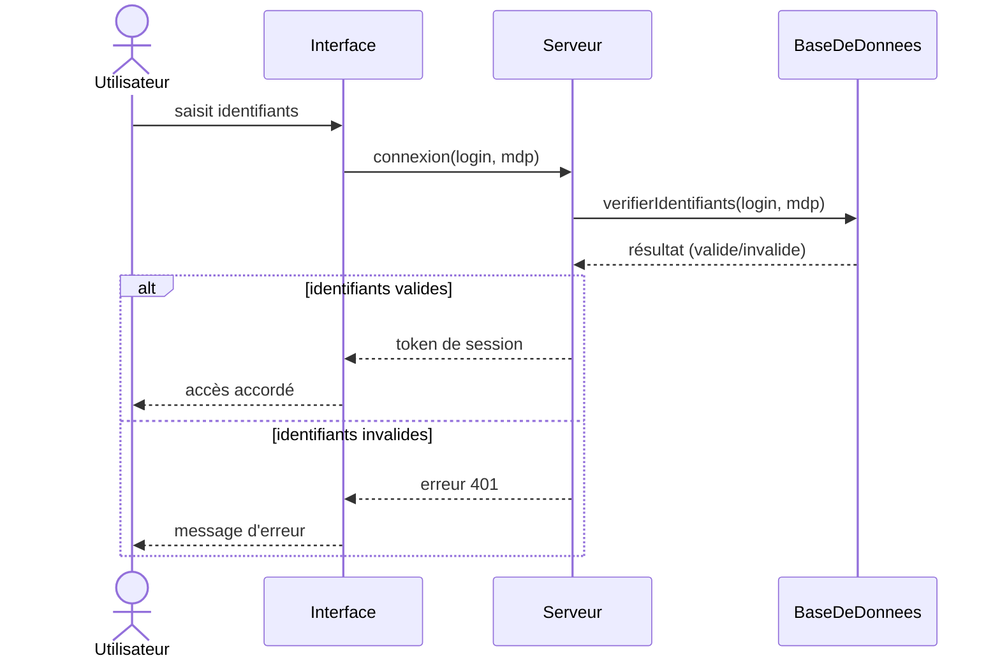
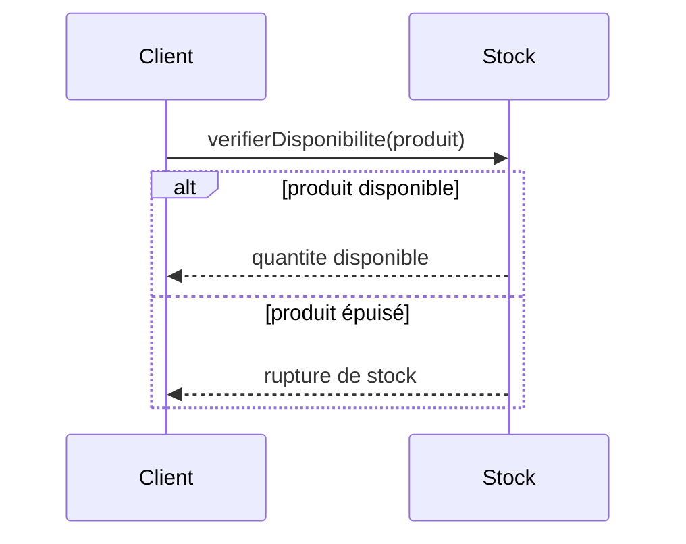
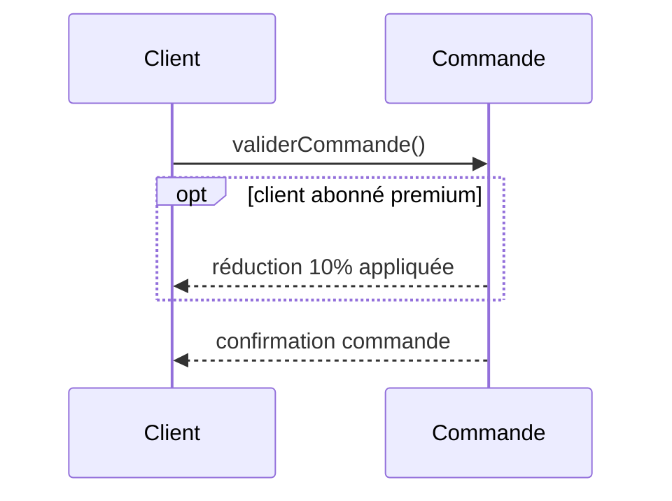
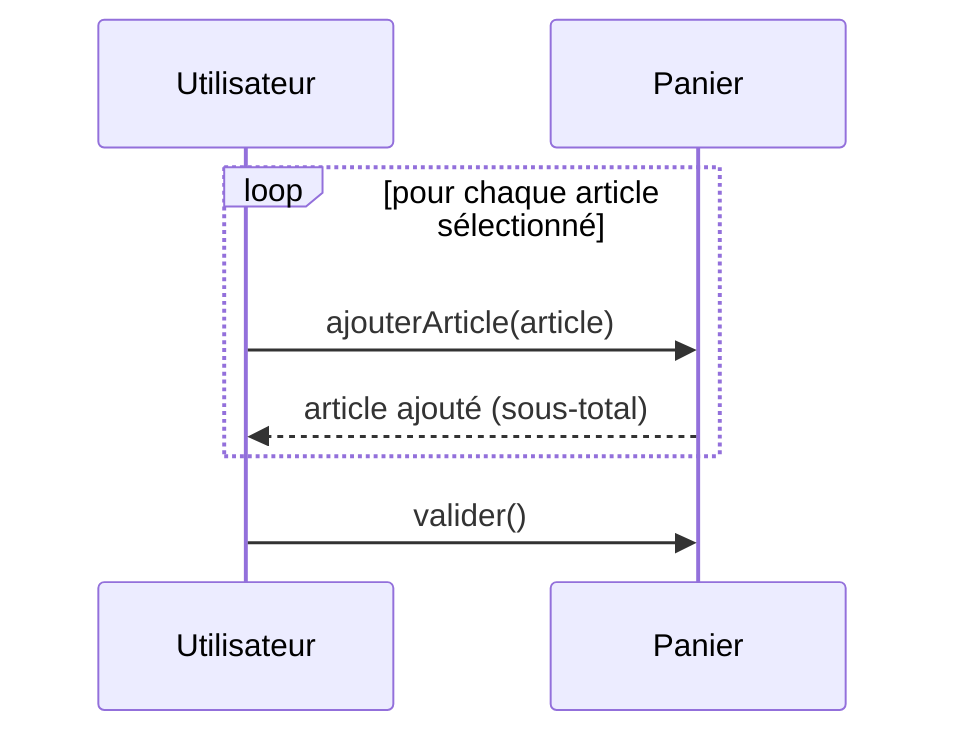
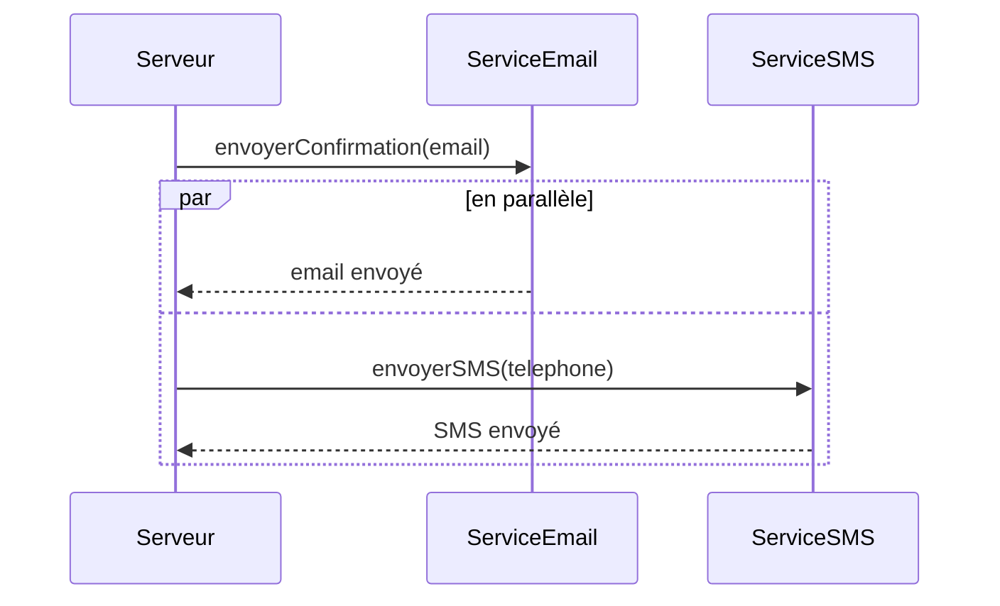
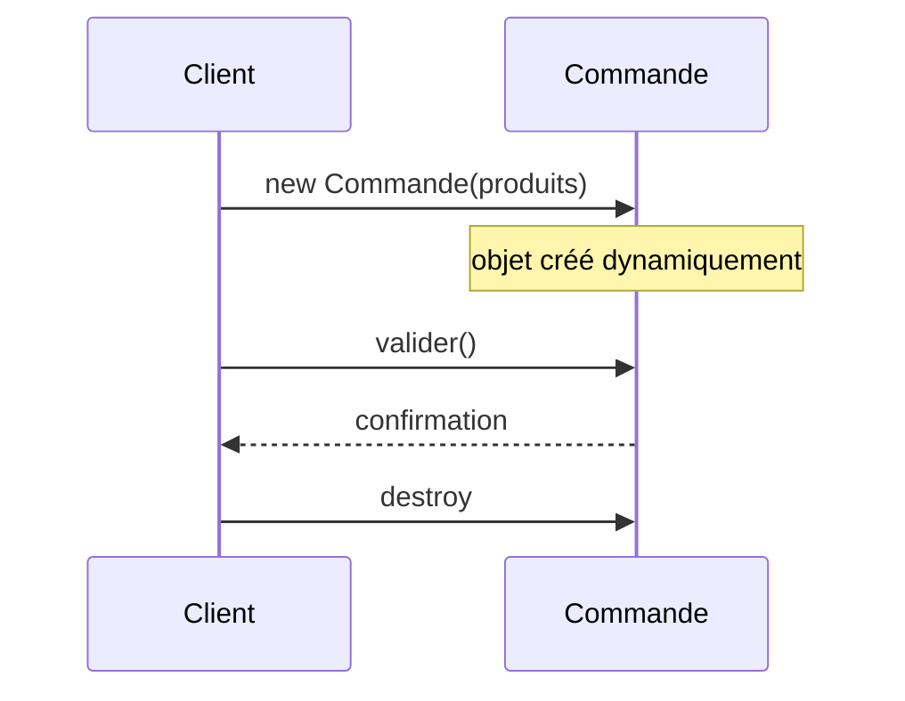
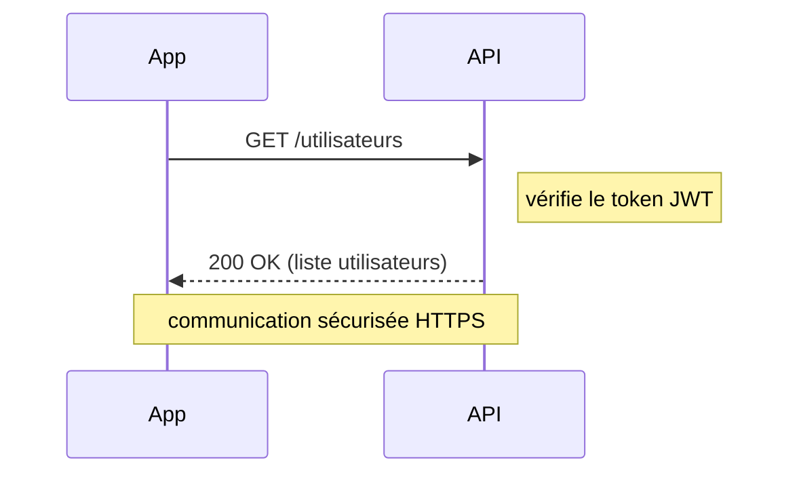
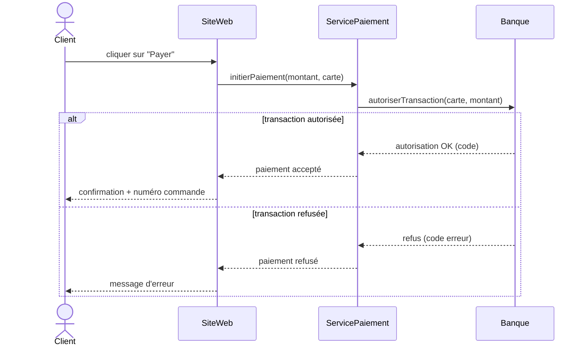

# 03 - Diagramme de séquence

Décrit **les échanges de messages entre objets ou acteurs dans le temps**. C'est le diagramme idéal pour visualiser ce qui se passe concrètement lorsqu'un scénario précis est déclenché (ex : "que se passe-t-il quand l'utilisateur clique sur 'Payer' ?").

## Objectifs pédagogiques

- Comprendre la notion de ligne de vie (lifeline)
- Distinguer message synchrone, asynchrone et retour
- Utiliser les fragments combinés : `alt`, `opt`, `loop`, `par`
- Savoir modéliser un scénario complet étape par étape

---

## 1. Les éléments fondamentaux

### Participants et lignes de vie

Chaque **participant** (acteur, objet, service…) est représenté en haut du diagramme avec une ligne pointillée qui descend vers le bas. Cette ligne s'appelle la **ligne de vie** (lifeline).

```
Acteur        Objet A       Objet B
  |              |              |
  |              |              |    ← temps s'écoule vers le bas
  |              |              |
```

### Types de messages

| Type | Notation Mermaid | Signification |
|------|-----------------|---------------|
| Appel synchrone | `->>` | l'expéditeur attend la réponse avant de continuer |
| Retour de réponse | `-->>` | réponse à un appel synchrone (en pointillé) |
| Appel asynchrone | `--)` | l'expéditeur n'attend pas la réponse |
| Auto-message | vers soi-même | un objet s'appelle lui-même (boucle interne) |

### Barre d'activation

Une **barre rectangulaire** sur la ligne de vie indique qu'un objet est en train de traiter une requête. Elle démarre à la réception d'un message et se termine quand la réponse est envoyée.

---

## 2. Exemple de base : connexion utilisateur



**Lecture pas à pas :**
1. L'Utilisateur saisit ses identifiants → l'Interface les reçoit.
2. L'Interface demande au Serveur de vérifier la connexion.
3. Le Serveur interroge la Base de données.
4. La Base répond avec un résultat.
5. Selon le résultat : soit la session est créée, soit une erreur est renvoyée.

---

## 3. Les fragments combinés (blocs de contrôle)

Les fragments permettent de modéliser des **conditions**, des **boucles** et du **parallélisme**.

### 3.1 `alt` / `else` — condition (if / else)



### 3.2 `opt` — bloc optionnel (if sans else)



### 3.3 `loop` — répétition



### 3.4 `par` — exécution en parallèle



### Tableau récapitulatif des fragments

| Fragment | Rôle |
|----------|------|
| `alt / else` | Condition (if / else if / else) |
| `opt` | Bloc optionnel (if sans else) |
| `loop` | Répétition (for, while…) |
| `par` | Traitements en parallèle |
| `ref` | Référence à un autre diagramme de séquence |

---

## 4. Création et destruction d'objets

Un objet peut être **créé en cours de scénario** (message de création) ou **détruit** (message de destruction, marqué par une croix ✕ sur la ligne de vie).



---

## 5. Les notes

On peut ajouter des **annotations** pour clarifier un message ou un état.



---

## 6. Exemple complet : paiement en ligne



---

## 7. Diagramme de séquence vs diagramme de classes

| | Diagramme de classes | Diagramme de séquence |
|-|----------------------|----------------------|
| Décrit | la **structure** statique | le **comportement** dynamique dans le temps |
| Répond à | "comment c'est organisé ?" | "que se passe-t-il, étape par étape ?" |
| Niveau | conception générale | scénario précis |

> Les deux sont **complémentaires** : les classes définissent qui existe, le diagramme de séquence montre comment ils interagissent.

---

## 8. Méthode pour construire un diagramme de séquence

1. **Identifier le scénario** à modéliser (un et un seul cas d'utilisation à la fois).
2. **Lister les participants** (acteurs, systèmes, services).
3. **Écrire le scénario principal** (cas nominal) de haut en bas.
4. **Ajouter les cas alternatifs** avec `alt` / `opt`.
5. **Ajouter les boucles** si besoin avec `loop`.
6. **Vérifier** : chaque message d'appel a-t-il un retour si nécessaire ?

---

## À retenir

- Le temps s'écoule **de haut en bas**
- Flèches pleines (`->>`) = appels | Pointillées (`-->>`) = retours
- `alt` = if/else | `opt` = if seul | `loop` = répétition | `par` = parallèle
- Un diagramme de séquence = **un scénario précis**, pas le système entier
- Toujours nommer les messages avec un **verbe d'action**
