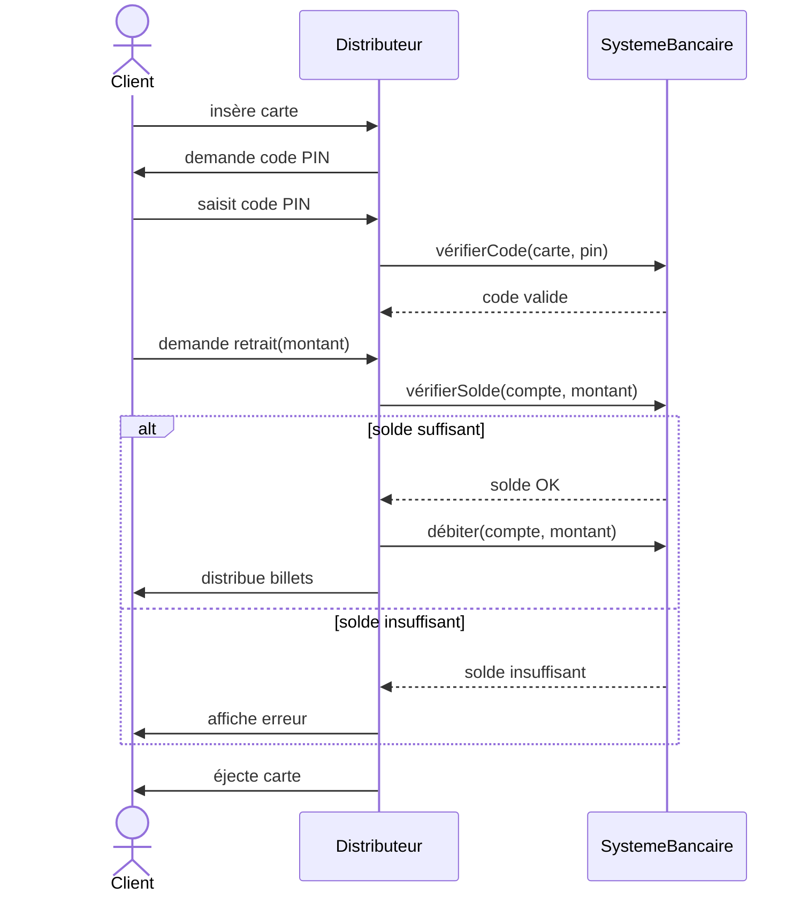

# Exemple : retrait au distributeur (ATM)

```mermaid
sequenceDiagram
    actor Client
    participant Distributeur
    participant SystemeBancaire

    Client->>Distributeur: insère carte
    Distributeur->>Client: demande code PIN
    Client->>Distributeur: saisit code PIN
    Distributeur->>SystemeBancaire: vérifierCode(carte, pin)
    SystemeBancaire-->>Distributeur: code valide

    Client->>Distributeur: demande retrait(montant)
    Distributeur->>SystemeBancaire: vérifierSolde(compte, montant)

    alt solde suffisant
        SystemeBancaire-->>Distributeur: solde OK
        Distributeur->>SystemeBancaire: débiter(compte, montant)
        Distributeur->>Client: distribue billets
    else solde insuffisant
        SystemeBancaire-->>Distributeur: solde insuffisant
        Distributeur->>Client: affiche erreur
    end

    Distributeur->>Client: éjecte carte
```
