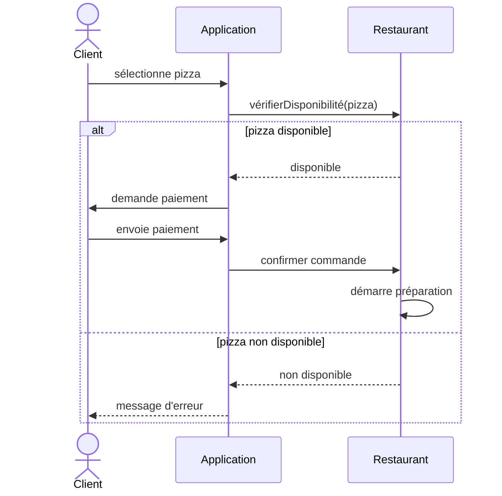

# Correction — Exercice 1

## Points clés à vérifier

- ✅ Le bloc `alt/else` encadre bien **toute** la suite d'actions liées à la disponibilité, pas juste un message
- ✅ Les flèches de retour (`-->`) sont bien utilisées pour les réponses (disponibilité, confirmation), les flèches pleines (`->`) pour les appels/actions
- ✅ L'ordre logique est respecté : vérification avant paiement, paiement avant confirmation
- ✅ "Restaurant démarre préparation" peut être représenté comme un self-message (flèche vers soi-même) puisque c'est une action interne
