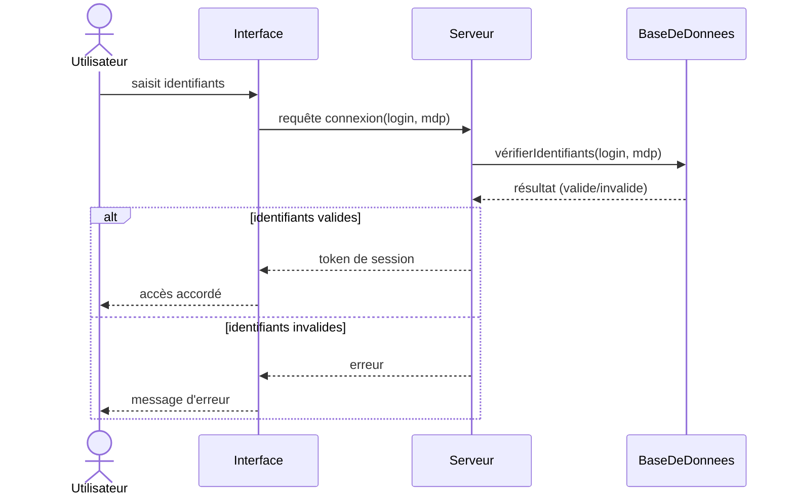
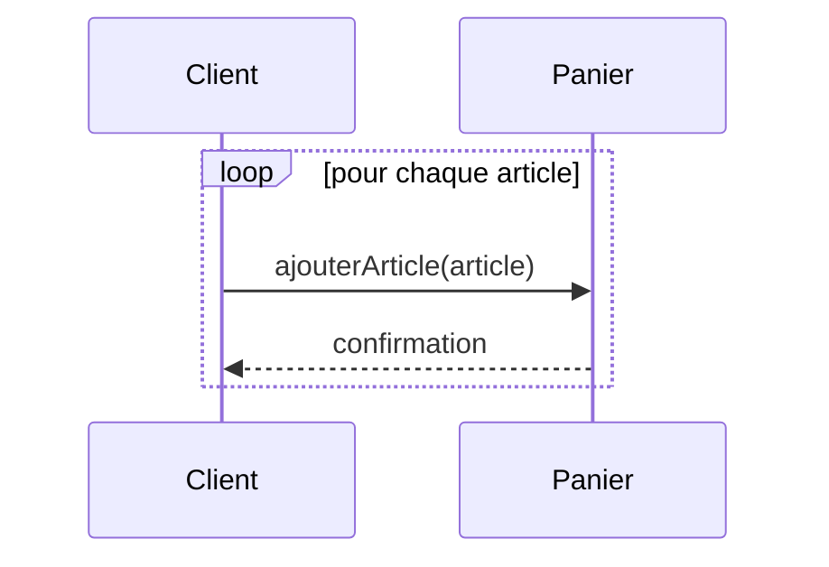

# 03 - Diagramme de séquence

Décrit **les échanges de messages entre objets/acteurs dans le temps**. Très utile pour visualiser un scénario précis (ex : "que se passe-t-il quand l'utilisateur clique sur 'Payer' ?").

## Éléments clés

- **Acteur / Objet** : participant à l'interaction (en haut, avec une "ligne de vie" verticale en pointillé)
- **Ligne de vie** (lifeline) : trait vertical pointillé qui descend dans le temps
- **Message** : flèche horizontale entre deux lignes de vie
  - flèche pleine `→` : appel synchrone
  - flèche pointillée `-->` : retour de réponse
  - flèche ouverte : appel asynchrone
- **Activation** (barre rectangulaire) : période où l'objet est "actif" / traite une requête
- **Note / Alt / Loop** : blocs pour conditions ou répétitions

## Exemple simple : connexion utilisateur

## Les blocs combinés (fragments)

| Bloc | Usage |
|---|---|
| `alt / else` | condition (if / else) |
| `opt` | bloc optionnel (if sans else) |
| `loop` | répétition |
| `par` | exécution en parallèle |

### Exemple avec boucle

## Diagramme de séquence vs diagramme de classes

| | Classes | Séquence |
|---|---|---|
| Décrit | structure (statique) | comportement (dynamique, dans le temps) |
| Répond à | "comment c'est organisé ?" | "que se passe-t-il, étape par étape ?" |

## À retenir

- Le temps s'écoule **de haut en bas**
- Les flèches pleines = appels, pointillées = retours
- Utilise `alt`/`opt`/`loop` pour représenter conditions et répétitions
- Très utile pour documenter un cas d'utilisation précis (souvent en complément du diagramme de cas d'utilisation)
