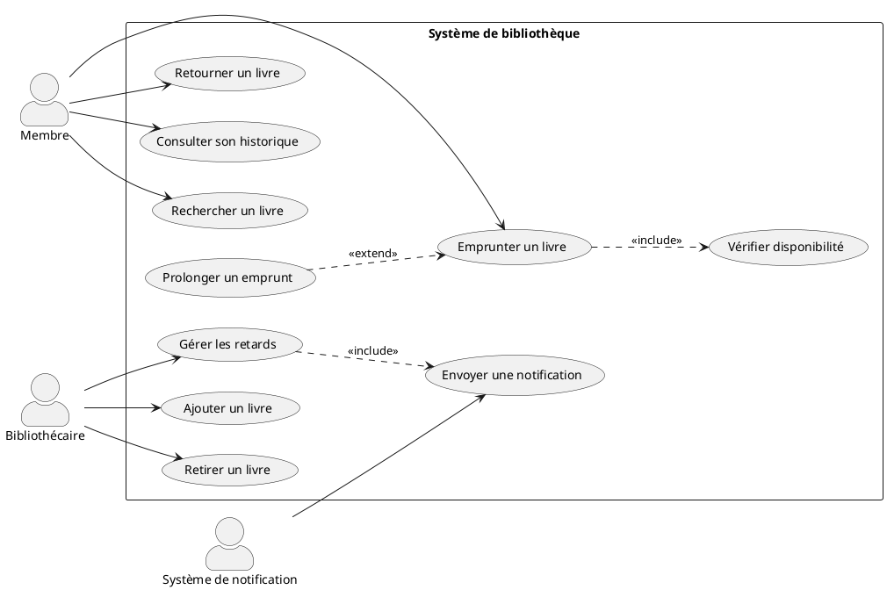
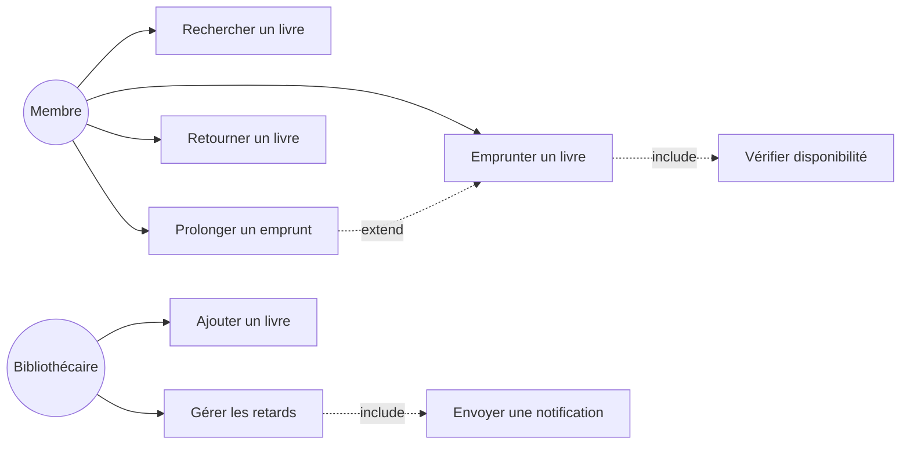

# 04 - Diagramme de cas d'utilisation (use case)

Décrit **les fonctionnalités du système vues par les utilisateurs (acteurs)**. C'est souvent le **premier diagramme produit** dans un projet : il sert à cadrer le périmètre fonctionnel et à répondre à la question "que peut faire qui ?".

## Objectifs pédagogiques

- Identifier les acteurs et les cas d'utilisation à partir d'un énoncé
- Distinguer `<<include>>` et `<<extend>>`
- Comprendre la généralisation d'acteurs
- Savoir délimiter le système correctement

---

## 1. Les éléments fondamentaux

| Élément | Représentation | Rôle |
|---------|----------------|------|
| **Acteur** | Bonhomme (stick figure) | Entité externe qui interagit avec le système |
| **Cas d'utilisation** | Ellipse | Fonctionnalité du système |
| **Système** | Rectangle englobant | Délimite ce qui est dans / hors du système |
| **Association** | Ligne simple | Lien entre un acteur et un cas d'utilisation |
| **`<<include>>`** | Flèche pointillée | Inclusion obligatoire |
| **`<<extend>>`** | Flèche pointillée | Extension optionnelle |
| **Généralisation** | Flèche triangulaire | Spécialisation d'acteur ou de cas d'utilisation |

---

## 2. Les acteurs

Un acteur est une **entité extérieure** au système qui l'utilise ou interagit avec lui.

### Types d'acteurs

- **Acteur humain** : utilisateur, administrateur, client, gestionnaire…
- **Acteur système** : une autre application, une API externe, un service tiers…
- **Acteur principal** : celui qui déclenche le cas d'utilisation (à gauche par convention)
- **Acteur secondaire** : celui qui est sollicité par le système pour compléter l'action (à droite)

> **Attention** : un acteur n'est **pas** une classe du système. C'est quelque chose d'**externe**.

---

## 3. Les cas d'utilisation

Un cas d'utilisation décrit une **fonctionnalité** du système telle qu'elle est perçue de l'extérieur.

### Règles de nommage

- Toujours un **verbe à l'infinitif** suivi d'un complément : "Réserver un billet", "Consulter l'historique"
- **Niveau fonctionnel** (pas technique) : "Payer en ligne" et non "Appeler l'API Stripe"
- Un cas d'utilisation = **un objectif utilisateur** accompli

### Ce qu'un cas d'utilisation n'est PAS

- Une étape interne (ex : "vérifier le mot de passe" n'est pas un cas d'utilisation, c'est une étape dans "Se connecter")
- Une fonction technique (ex : "Logger en base de données")

---

## 4. Les relations entre cas d'utilisation

### 4.1 `<<include>>` — inclusion obligatoire

A `<<include>>` B signifie : **chaque fois que A est exécuté, B l'est aussi systématiquement**.  
C'est une dépendance obligatoire.

```
Réserver un billet ──include──> Payer en ligne
```

*À chaque réservation, le paiement est obligatoirement déclenché.*

### 4.2 `<<extend>>` — extension optionnelle

A `<<extend>>` B signifie : **B peut, dans certaines conditions, étendre le comportement de A**, mais ce n'est pas systématique.

```
Prolonger un emprunt ──extend──> Emprunter un livre
```

*On peut prolonger un emprunt seulement si certaines conditions sont remplies — ce n'est pas toujours le cas.*

### La règle mnémotechnique

| Relation | Obligatoire ? | Qui "étend/inclut" qui ? |
|----------|--------------|--------------------------|
| `<<include>>` | Oui, toujours | A a **besoin** de B pour fonctionner |
| `<<extend>>` | Non, conditionnel | B **enrichit** A dans certains cas |

> **Astuce :** `include` = toujours / `extend` = parfois

---

## 5. La généralisation

### Entre acteurs

Un acteur peut spécialiser un autre acteur (héritage) : le fils hérite de tous les cas d'utilisation du père.

```
Administrateur ──généralise──> Utilisateur
```
*L'Administrateur peut tout faire que l'Utilisateur peut faire, plus d'autres choses.*

### Entre cas d'utilisation

Un cas d'utilisation peut être une spécialisation d'un autre.

```
Payer par carte ──généralise──> Payer
Payer par virement ──généralise──> Payer
```

---

## 6. Exemple complet en PlantUML : système de bibliothèque



---

## 7. Exemple Mermaid (approximation)

Mermaid n'a pas de syntaxe native "use case" — on utilise un graphe orienté :



---

## 8. Méthode pour construire un diagramme de cas d'utilisation

1. **Identifier les acteurs** : qui utilise le système ? qui déclenche des fonctions ? qui en reçoit les résultats ?
2. **Lister les cas d'utilisation** : pour chaque acteur, demander "qu'est-ce qu'il veut faire ?"
3. **Relier acteurs et cas d'utilisation** par des associations.
4. **Chercher les `include`** : y a-t-il des étapes **toujours obligatoires** dans un cas ?
5. **Chercher les `extend`** : y a-t-il des comportements **optionnels ou conditionnels** ?
6. **Vérifier le périmètre** : tout ce qui est dans le rectangle doit être **réalisé par le système**.

---

## 9. Erreurs classiques à éviter

| Erreur | Correction |
|--------|------------|
| Nommer un cas d'utilisation avec un nom (ex : "Paiement") | Utiliser un verbe : "Effectuer un paiement" |
| Modéliser des étapes techniques | Rester au niveau fonctionnel/utilisateur |
| Confondre `include` et `extend` | include = obligatoire ; extend = conditionnel |
| Mettre des acteurs internes au système | Un acteur est toujours **externe** |
| Trop décomposer | Un diagramme de cas d'utilisation reste **haut niveau** |

---

## À retenir

- Acteur = entité **externe** (humain ou système) qui interagit avec le système
- Cas d'utilisation = **verbe à l'infinitif** décrivant une fonctionnalité
- `<<include>>` = toujours exécuté (obligatoire)
- `<<extend>>` = parfois exécuté (optionnel/conditionnel)
- Ce diagramme répond à "**qui fait quoi ?**", pas "comment c'est fait ?"
