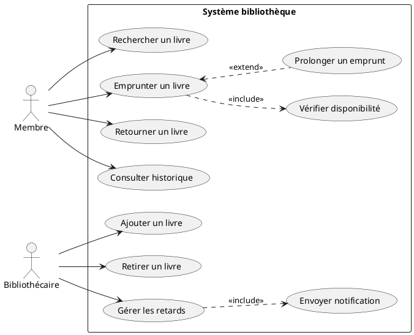

# Correction — Exercice 1

## Raisonnement

- "Emprunter un livre" **doit toujours** vérifier la disponibilité → relation `<<include>>`
- "Prolonger un emprunt" est **optionnel**, conditionné (pas de réservation) → relation `<<extend>>` sur "Emprunter un livre"
- "Gérer les retards" **déclenche systématiquement** une notification → `<<include>>`

## Diagramme (PlantUML)

## Points clés à vérifier

- ✅ "Vérifier disponibilité" et "Envoyer notification" sont bien des cas d'utilisation à part entière, reliés en `<<include>>`
- ✅ "Prolonger un emprunt" est en `<<extend>>` car conditionnel (pas systématique)
- ✅ Tu n'as pas mis le Bibliothécaire comme acteur des actions réservées aux Membres (et inversement)
