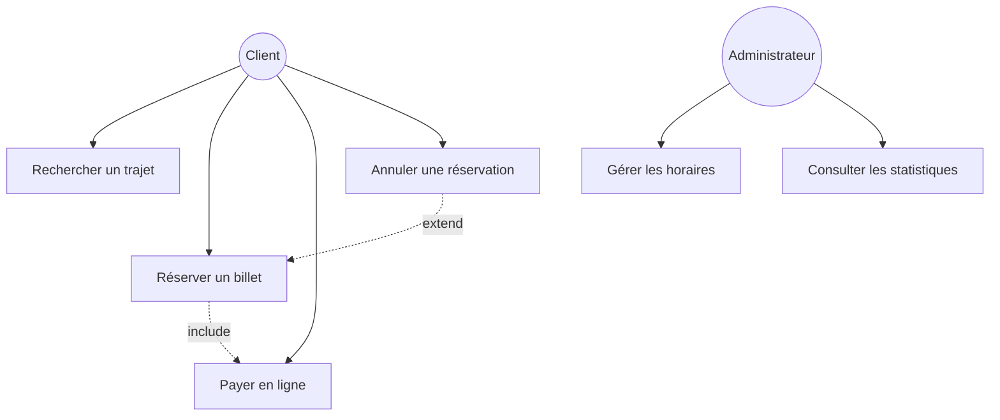
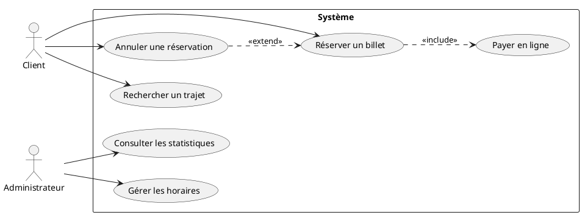

# 04 - Diagramme de cas d'utilisation (use case)

Décrit **les fonctionnalités du système vues par les utilisateurs (acteurs)**. C'est souvent le premier diagramme produit dans un projet : il sert à cadrer le périmètre fonctionnel.

## Éléments clés

- **Acteur** : personne ou système externe qui interagit avec le système (représenté par un bonhomme/stick figure)
- **Cas d'utilisation** (use case) : une fonctionnalité, représentée par une ellipse, nommée par un verbe à l'infinitif
- **Système** : le périmètre, représenté par un rectangle englobant les cas d'utilisation
- **Relations** :
  - **Association** : acteur ↔ cas d'utilisation
  - **Inclusion** (`<<include>>`) : un cas d'utilisation en utilise systématiquement un autre
  - **Extension** (`<<extend>>`) : un cas d'utilisation peut optionnellement en déclencher un autre
  - **Généralisation** : un acteur/cas d'utilisation est une spécialisation d'un autre

## Exemple : système de réservation de billets

> ℹ️ Mermaid n'a pas de syntaxe native "use case diagram" comme PlantUML. On utilise souvent un `graph` stylisé, ou on bascule sur PlantUML qui gère ça nativement. Voir l'exemple PlantUML ci-dessous.

## Le même exemple en PlantUML (rendu plus fidèle)

## Inclusion vs Extension : le piège classique

- **`<<include>>`** : le cas d'utilisation A a **toujours** besoin de B pour se terminer. Ex : "Réserver un billet" inclut toujours "Payer en ligne".
- **`<<extend>>`** : le cas d'utilisation B est **optionnel**, il peut enrichir A dans certaines conditions. Ex : "Annuler une réservation" est une extension possible (pas systématique) de "Réserver un billet".

> 💡 Astuce mnémotechnique : *include = obligatoire*, *extend = optionnel*.

## À retenir

- Niveau de détail volontairement **haut niveau** (pas de détail technique ici, c'est le rôle du diagramme de séquence)
- Les noms de cas d'utilisation = verbes d'action ("Réserver", "Payer", "Annuler")
- Ne pas confondre acteur (humain ou système externe) avec une classe du système
