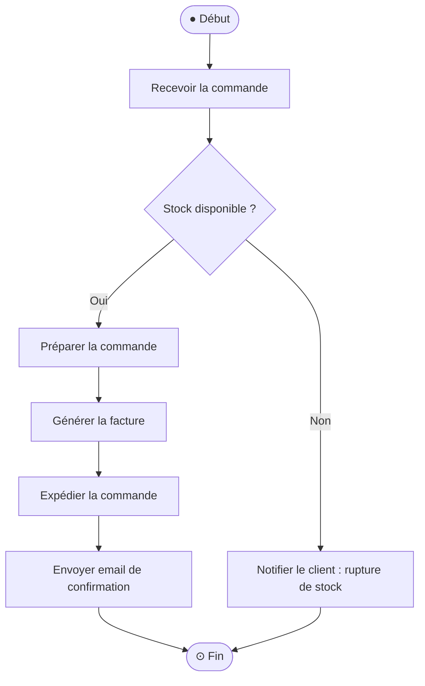
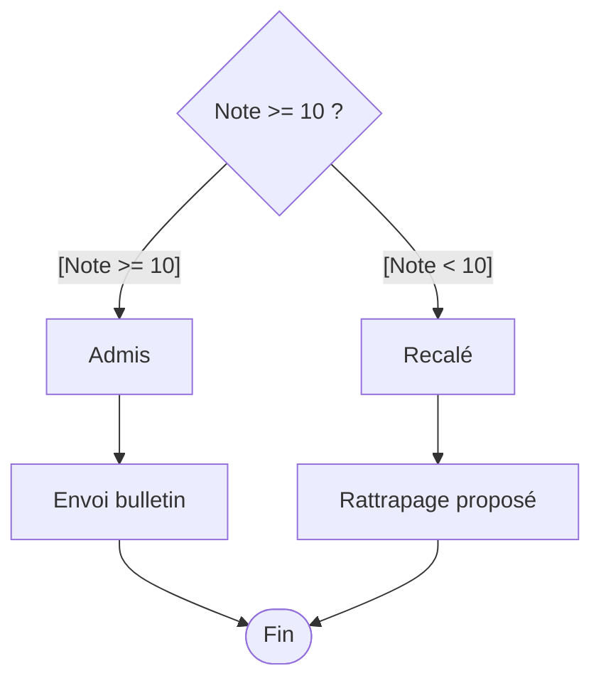
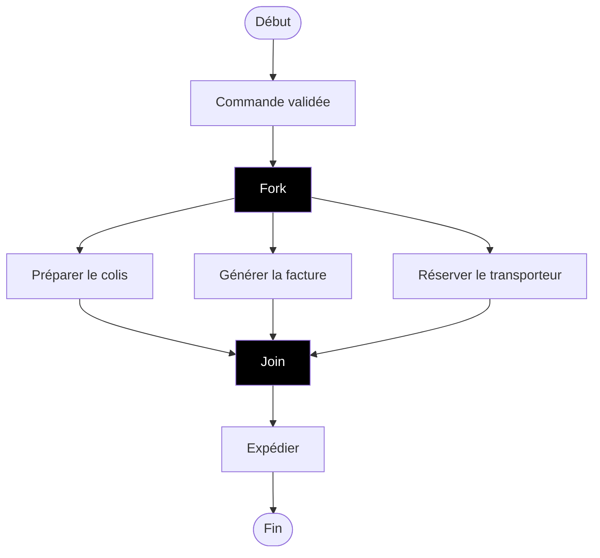
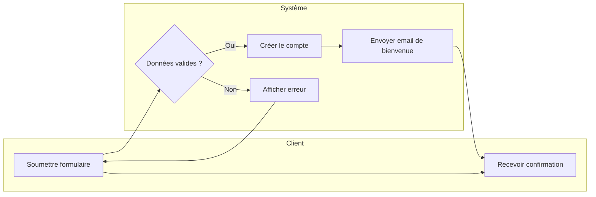
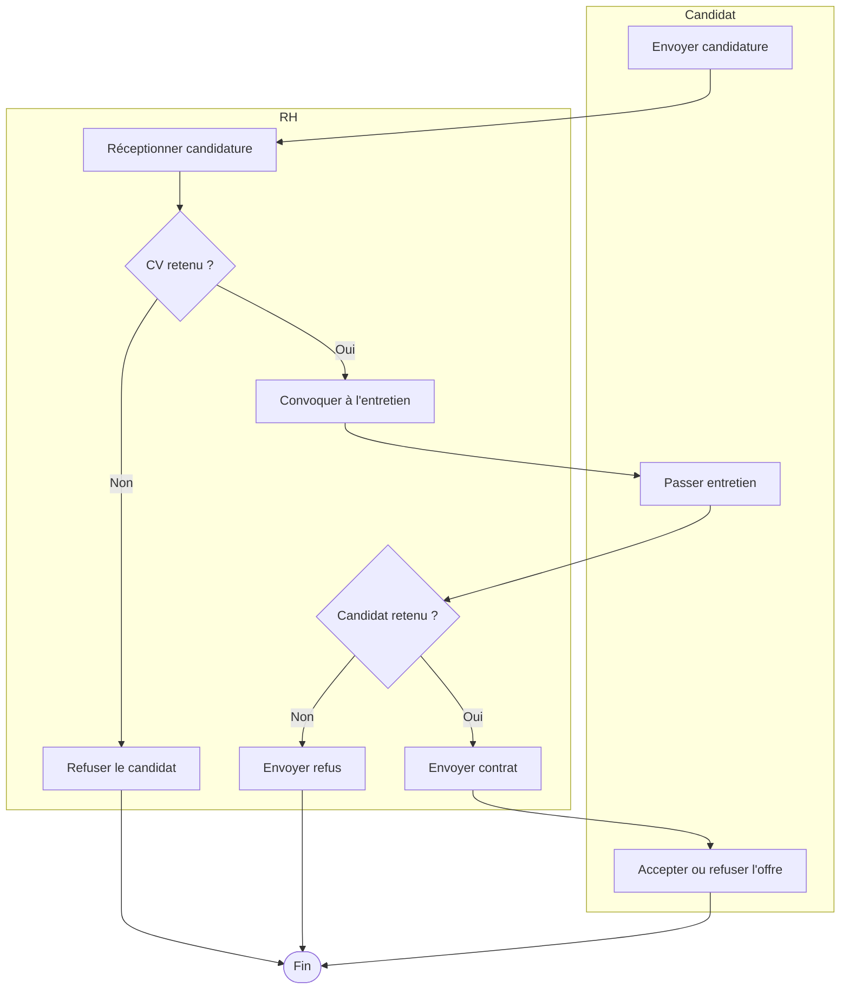

# 05 - Diagramme d'activité

Décrit **un flux d'actions, un algorithme ou un processus métier**, étape par étape, avec des conditions et des parallélismes. C'est le diagramme UML le plus proche d'un **organigramme** classique, mais avec des conventions plus précises.

## Objectifs pédagogiques

- Modéliser un processus métier avec début, actions, décisions et fin
- Utiliser les gardes (`[condition]`) sur les branches de décision
- Représenter le parallélisme avec fork et join
- Utiliser les couloirs (swimlanes) pour distinguer les responsables

---

## 1. Les éléments fondamentaux

| Élément | Représentation | Rôle |
|---------|----------------|------|
| **Début** | Rond noir plein ● | Point d'entrée unique |
| **Fin d'activité** | Rond cerclé ⊙ | Fin du processus |
| **Fin de flux** | Croix cerclée ⊗ | Arrêt d'un flux partiel (pas du processus entier) |
| **Action** | Rectangle arrondi | Une étape/tâche à accomplir |
| **Décision** | Losange | Branchement conditionnel (une entrée, plusieurs sorties) |
| **Fusion** | Losange | Rejoint plusieurs branches (plusieurs entrées, une sortie) |
| **Fork** | Barre noire épaisse | Divise le flux en branches parallèles |
| **Join** | Barre noire épaisse | Synchronise des branches parallèles |
| **Swimlane** | Colonnes | Attribue les actions à des responsables |

---

## 2. Exemple simple : traitement d'une commande

> Les étiquettes sur les flèches de décision s'appellent des **gardes** : `[condition]`.  
> Elles doivent couvrir **tous les cas possibles** (sinon le flux peut rester bloqué).

---

## 3. Les gardes (conditions)

Une **garde** est une condition entre crochets qui détermine quelle branche est empruntée.

Règles :
- Les gardes doivent être **mutuellement exclusives** (on ne peut pas prendre deux branches en même temps).
- Elles doivent être **exhaustives** (tous les cas sont couverts).

---

## 4. Le parallélisme : Fork et Join

Quand plusieurs actions doivent se dérouler **en même temps**, on utilise :
- **Fork** : divise le flux en plusieurs branches parallèles
- **Join** : attend que **toutes** les branches soient terminées pour continuer

> **Différence Fork/Join vs Décision/Fusion :**
> - Décision/Fusion → **un seul chemin** est emprunté (exclusif)
> - Fork/Join → **tous les chemins** sont exécutés en parallèle

---

## 5. Les couloirs (swimlanes)

Les swimlanes permettent de **répartir les actions entre différents acteurs ou services**, ce qui rend immédiatement visible "qui fait quoi".

---

## 6. Exemple complet avec swimlanes : processus de recrutement

---

## 7. Diagramme d'activité vs diagramme de séquence

| | Activité | Séquence |
|-|----------|----------|
| Focus | le **processus/flux** lui-même | les **échanges entre objets** |
| Acteurs visibles ? | optionnel (via swimlanes) | toujours (lignes de vie) |
| Parallélisme | oui (fork/join) | oui (par) |
| Utilisateurs cibles | métier + technique | plutôt technique |
| Bon pour | algorithmes, processus métier | scénarios d'interaction technique |

---

## 8. Méthode pour construire un diagramme d'activité

1. **Définir le début** : qu'est-ce qui déclenche le processus ?
2. **Lister toutes les actions** dans l'ordre.
3. **Identifier les décisions** : à quels endroits le flux peut-il bifurquer ?
4. **Écrire les gardes** sur chaque branche de décision.
5. **Identifier les parallélismes** : des actions peuvent-elles se faire en même temps ?
6. **Identifier la fin** : à quel(s) moment(s) le processus se termine-t-il ?
7. **Ajouter les swimlanes** si plusieurs acteurs sont impliqués.

---

## 9. Erreurs classiques à éviter

| Erreur | Correction |
|--------|------------|
| Gardes incomplètes sur une décision | Toujours couvrir **tous les cas** |
| Confondre fork et décision | Fork = **parallèle** ; Décision = **exclusif** |
| Oublier le Join après un Fork | Chaque Fork doit avoir son Join (sauf fin de flux) |
| Trop détailler les actions | Rester à un niveau d'**abstraction cohérent** |
| Plusieurs points de départ | Il n'y a **qu'un seul** état initial |

---

## À retenir

- Début (●) → actions → décisions (◇) → fin (⊙)
- Gardes `[condition]` sur les branches de décision — elles doivent tout couvrir
- Fork/Join = **parallèle** | Décision/Fusion = **exclusif**
- Swimlanes = "qui fait quoi" (très utile pour les processus multi-acteurs)
- Plus lisible qu'un diagramme de séquence pour un processus métier haut niveau
