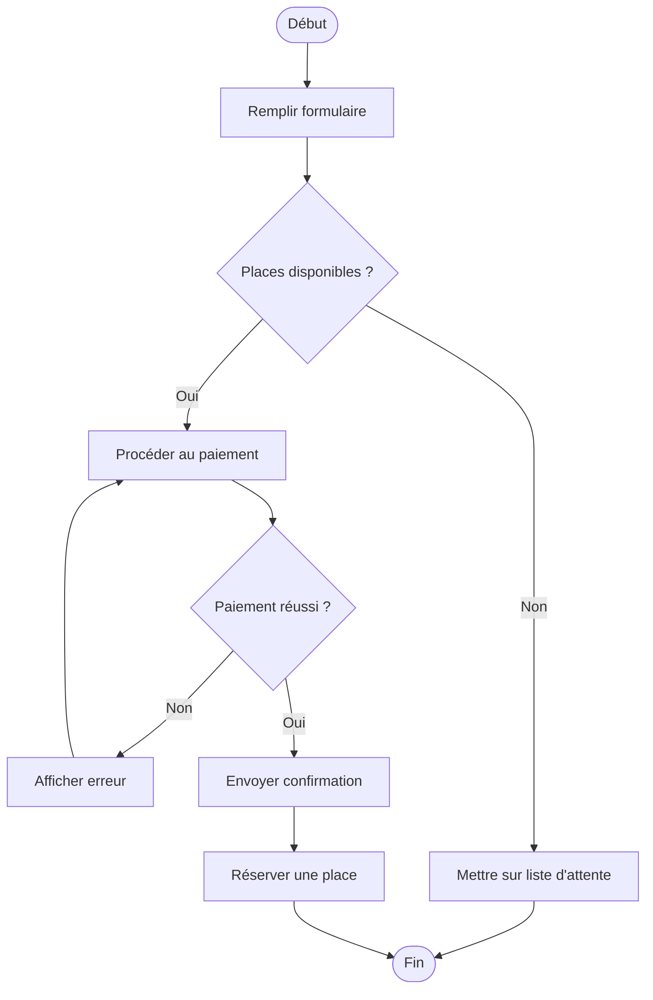

# Correction — Exercice 1

## Points clés à vérifier

- ✅ Deux décisions imbriquées (disponibilité, puis paiement) — bien distinguées
- ✅ La boucle de retour en cas d'échec de paiement (le candidat peut retenter)
- ✅ Toutes les branches finissent bien par converger vers la fin
- ✅ "Liste d'attente" est un chemin alternatif complet, pas juste un message
