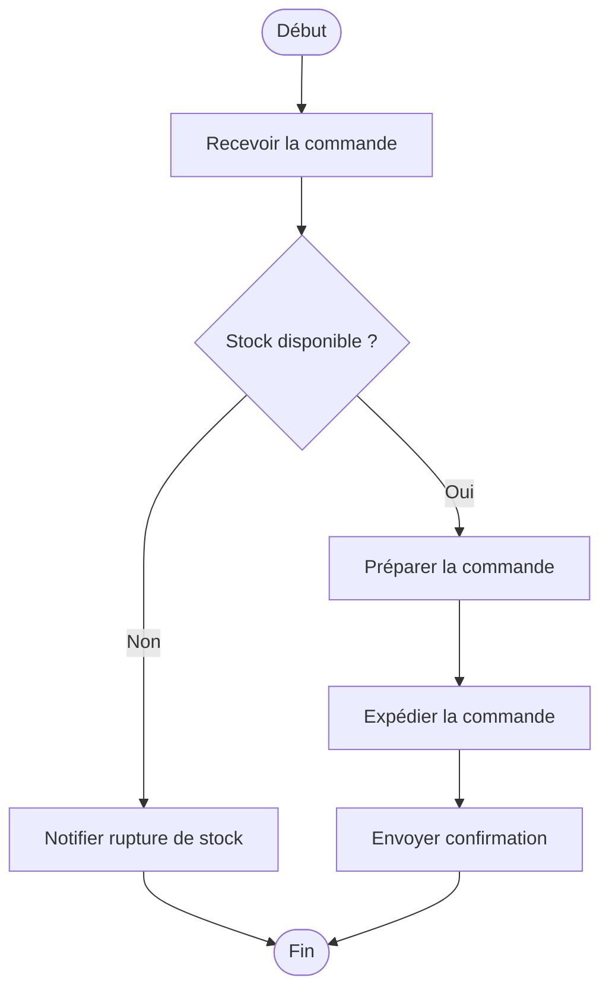
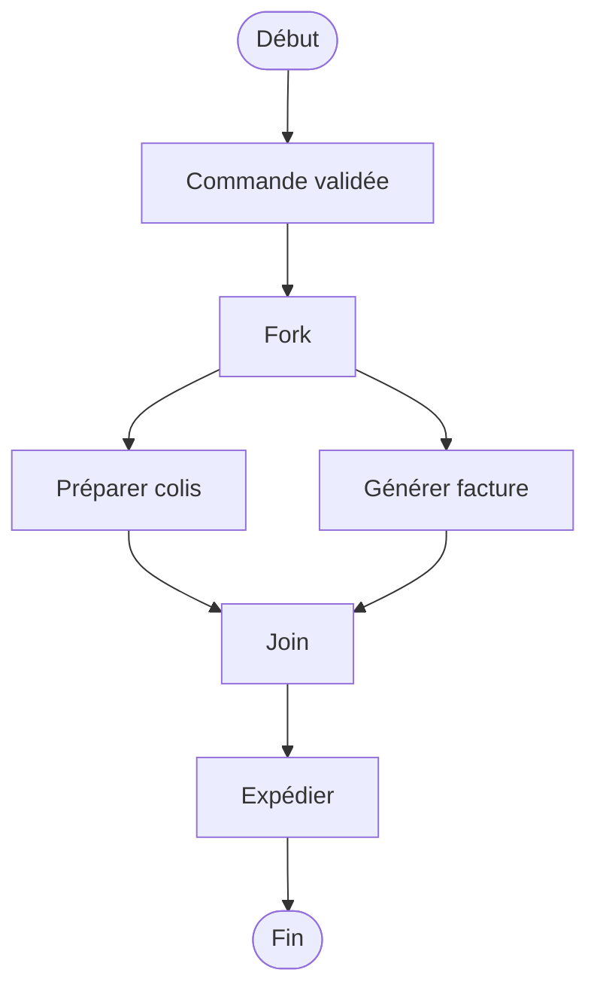

# 05 - Diagramme d'activité

Décrit **un flux/algorithme/processus métier**, étape par étape, avec des conditions et des parallélismes. Très proche d'un organigramme (flowchart) classique.

## Éléments clés

| Élément | Représentation |
|---|---|
| Début | rond noir plein |
| Fin | rond noir cerclé (bullseye) |
| Action | rectangle aux coins arrondis |
| Décision | losange |
| Fork/Join (parallélisme) | barre noire horizontale/verticale |
| Couloir (swimlane) | colonnes pour séparer les responsables |

## Exemple : traitement d'une commande

## Exemple avec parallélisme (fork/join)

## Diagramme d'activité vs diagramme de séquence

| | Activité | Séquence |
|---|---|---|
| Focus | le **processus/flux** lui-même | les **échanges entre objets** |
| Acteurs visibles ? | pas forcément (ou en couloirs) | toujours (lignes de vie) |
| Bon pour | algorithmes, processus métier | scénarios d'interaction technique |

## À retenir

- Très lisible pour des non-techniques (proche d'un organigramme classique)
- Utilise des couloirs (swimlanes) si plusieurs acteurs/services sont impliqués
- Le losange = toujours une décision binaire ou multiple (avec conditions sur les flèches sortantes)
