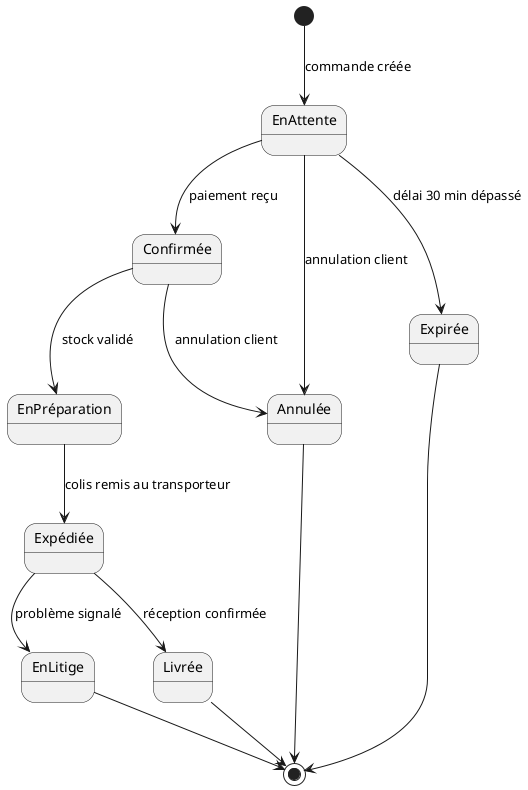
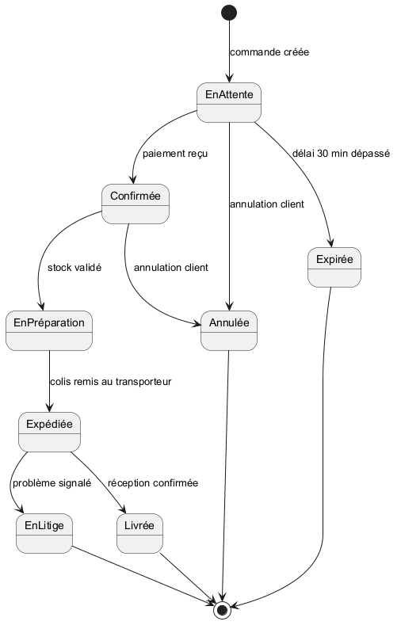
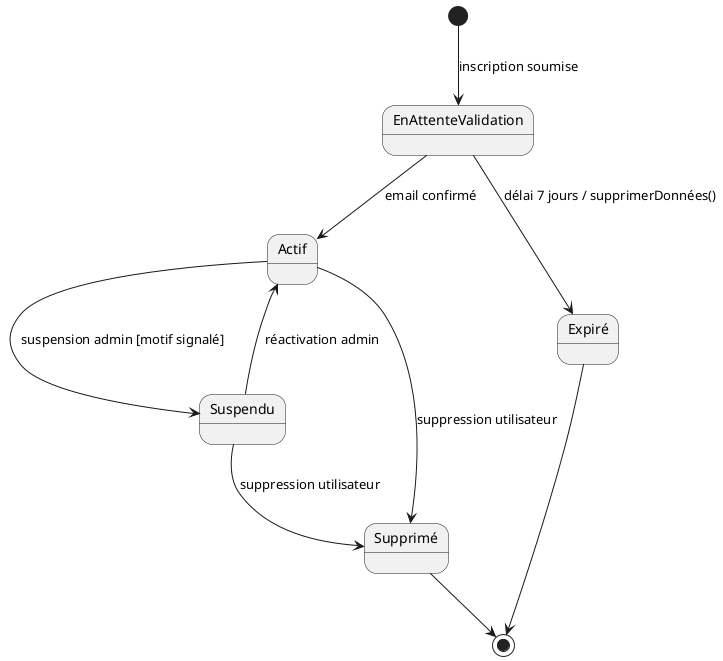
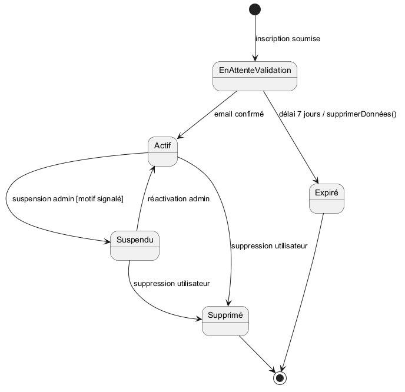
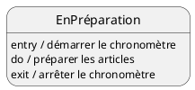
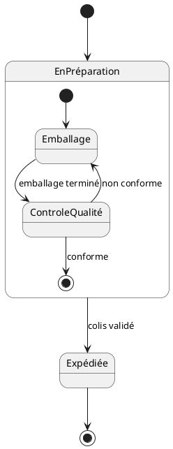

# 06 - Diagramme d'états (state machine)

Décrit **le cycle de vie d'un objet** : tous les états qu'il peut prendre, et les **transitions** (événements ou conditions) qui le font passer d'un état à un autre. On parle aussi de "machine à états" ou "automate".

## Objectifs pédagogiques

- Identifier les états possibles d'un objet
- Modéliser les transitions et leurs déclencheurs
- Utiliser les actions `entry`, `exit`, `do`
- Représenter des états composites (avec sous-états)

---

## 1. Différence avec le diagramme d'activité

| | Diagramme d'états | Diagramme d'activité |
|-|-------------------|----------------------|
| Centré sur | **un objet** et ses états possibles | **un processus** global |
| Question | "Dans quel état est cet objet à tout moment ?" | "Quelles sont les étapes du processus ?" |
| Idéal pour | Modéliser la vie d'une entité (commande, compte…) | Modéliser un algorithme ou workflow |

---

## 2. Les éléments fondamentaux

| Élément | PlantUML | Rôle |
|---------|----------|------|
| **État initial** | `[*] -->` | Point d'entrée |
| **État** | nom simple ou `state "Nom" as X` | Situation stable de l'objet |
| **État final** | `--> [*]` | Fin du cycle de vie |
| **Transition** | `EtatA --> EtatB : événement` | Passage d'un état à un autre |
| **Garde** | `EtatA --> EtatB : evt [condition]` | Condition à vérifier |
| **Action** | `EtatA --> EtatB : evt / action()` | Action déclenchée lors de la transition |

---

## 3. Anatomie d'une transition

```
événement [garde] / action
```

- **événement** : ce qui se passe (ex : `paiementReçu`)
- **[garde]** : condition vérifiée avant de prendre la transition (ex : `[montant > 0]`)
- **/action** : ce qui est exécuté lors du franchissement (ex : `/envoyerEmail()`)

**Exemple :**
```
EnAttente --> Confirmée : paiementReçu [montant > 0] / envoyerEmail()
```

---

## 4. Exemple : cycle de vie d'une commande





---

## 5. Exemple : cycle de vie d'un compte utilisateur





---

## 6. Les actions dans un état

Un état peut avoir des **actions internes** :

| Mot-clé | Déclenchement |
|---------|---------------|
| `entry /` | À l'**entrée** dans l'état |
| `do /` | **Pendant** tout le temps où on est dans l'état |
| `exit /` | À la **sortie** de l'état |



---

## 7. Les états composites (sous-états)

Un état peut **contenir d'autres états** pour décomposer un comportement complexe.



---

## 8. Méthode pour construire un diagramme d'états

1. **Choisir l'objet** à modéliser (une entité dont l'état change dans le temps).
2. **Lister tous les états possibles** : dans quelles situations stables peut-il se trouver ?
3. **Identifier l'état initial** et le(s) état(s) final(s).
4. **Pour chaque paire d'états**, demander : "qu'est-ce qui peut faire passer de l'un à l'autre ?" → c'est l'événement.
5. **Ajouter les gardes** si la transition n'est possible que sous certaines conditions.
6. **Vérifier** que tous les états ont au moins une transition entrante et une sortante.

---

## 9. Exemples d'objets typiquement modélisés

| Objet | États typiques |
|-------|----------------|
| Commande | En attente → Confirmée → En préparation → Expédiée → Livrée |
| Compte utilisateur | En attente → Actif → Suspendu → Supprimé |
| Ticket de support | Ouvert → En cours → Résolu → Fermé |
| Connexion réseau | Déconnecté → Connexion en cours → Connecté → Erreur |

---

## 10. Erreurs classiques à éviter

| Erreur | Correction |
|--------|------------|
| Confondre état et action | Un état = situation **stable** ; une action = événement **ponctuel** |
| Oublier l'état initial | Toujours commencer par `[*]` |
| États sans transition de sortie | Tout état doit pouvoir en sortir (sauf l'état final) |
| Nommer les états avec des verbes | Les états se nomment avec des **participes passés ou noms** : "Confirmée", "EnAttente" |

---

## À retenir

- Un diagramme d'états = cycle de vie d'**un seul objet**
- Transition = `événement [garde] / action`
- `entry / exit / do` permettent d'attacher des actions à un état lui-même
- Les états composites permettent de décomposer des états complexes
- Très utile pour : commandes, comptes, tickets, connexions réseau…
