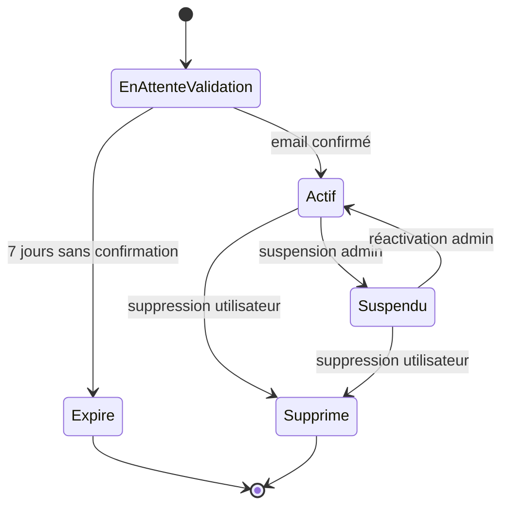

# Correction — Exercice 1

## Points clés à vérifier

- ✅ Deux états finaux distincts (Expiré et Supprimé), tous les deux atteignables depuis des chemins différents
- ✅ La transition automatique ("7 jours sans confirmation") est bien représentée comme un événement (pas une action)
- ✅ Le cycle Actif ↔ Suspendu (aller-retour) est bien représenté avec deux transitions distinctes
- ✅ "Supprimé" est accessible depuis Actif **et** Suspendu (deux flèches entrantes)
