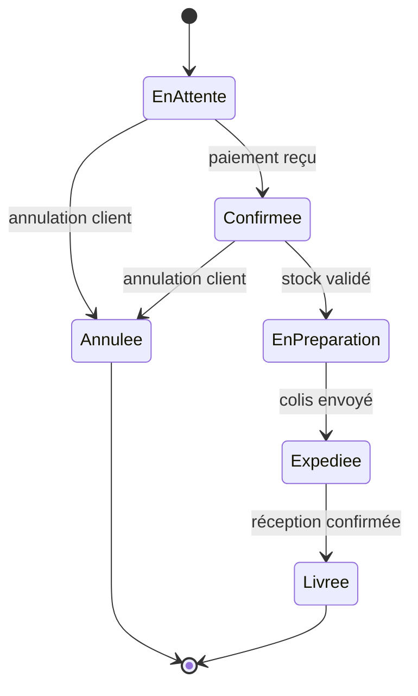
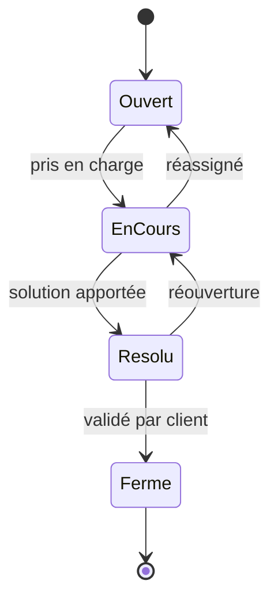
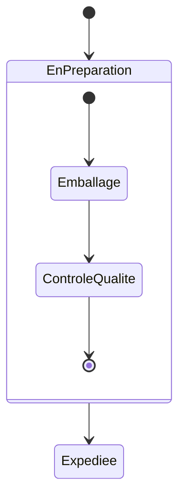

# 06 - Diagramme d'états (state machine)

Décrit **le cycle de vie d'un objet** : les états qu'il peut prendre, et les transitions (événements) qui le font passer d'un état à un autre.

## Différence avec le diagramme d'activité

| | États | Activité |
|---|---|---|
| Centré sur | **un objet** et ses états possibles | **un processus** global |
| Question posée | "dans quel état est cet objet à tout moment ?" | "quelles sont les étapes du processus ?" |

## Éléments clés

- **État** : rectangle aux coins arrondis
- **État initial** : rond noir plein
- **État final** : rond noir cerclé
- **Transition** : flèche étiquetée par l'événement déclencheur (et parfois une condition `[garde]`)

## Exemple : cycle de vie d'une commande

## Exemple : cycle de vie d'un ticket de support

## États composites (sous-états)

On peut imbriquer des états pour représenter des sous-comportements :

## À retenir

- Toujours partir d'un **état initial** et (idéalement) finir sur un **état final**
- Les transitions sont déclenchées par un **événement** (pas une simple étape de processus)
- Utile pour modéliser : statuts de commande, cycle de vie d'un compte utilisateur, état d'une connexion réseau, etc.
- Ne pas confondre avec le diagramme d'activité : ici on parle d'**états**, pas d'**actions séquentielles**
