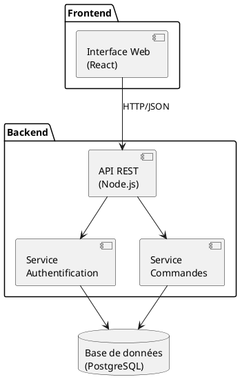
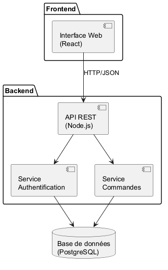
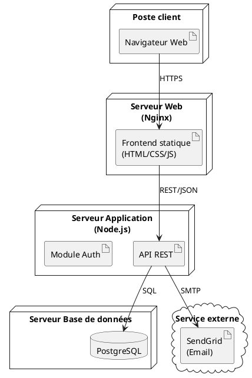
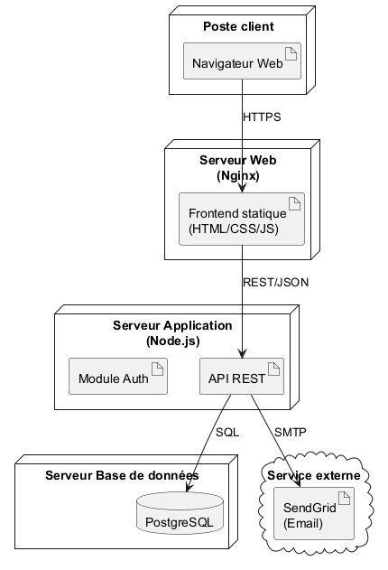

# 07 - Diagrammes de composants & de déploiement

Deux diagrammes structurels qui décrivent l'**architecture technique** d'un système : l'un sous l'angle logique (composants), l'autre sous l'angle physique (déploiement).

## Objectifs pédagogiques

- Comprendre la différence entre vue logique et vue physique
- Modéliser les dépendances entre composants logiciels
- Modéliser la répartition physique sur des nœuds (serveurs, machines)
- Savoir lire une architecture microservices ou en couches

---

## 1. Diagramme de composants

### Définition

Le diagramme de composants montre comment le système est découpé en **modules/composants logiciels** et comment ils **dépendent les uns des autres** via des interfaces.

Un **composant** est une unité logicielle autonome et remplaçable (module, bibliothèque, microservice, API…).

### Éléments clés

| Élément | PlantUML | Rôle |
|---------|----------|------|
| **Composant** | `[NomComposant]` | Unité logicielle |
| **Package** | `package "Nom" { }` | Regroupe des composants |
| **Base de données** | `database "Nom"` | Stockage de données |
| **Dépendance** | `[A] --> [B]` | A dépend de B |

### Exemple : architecture d'une application web

---

## 2. Diagramme de déploiement

### Définition

Le diagramme de déploiement montre la **répartition physique** des composants logiciels sur des **nœuds** (serveurs, machines, conteneurs, cloud…). Il répond à la question : "qui tourne où ?"

### Éléments clés

| Élément | PlantUML | Rôle |
|---------|----------|------|
| **Nœud** | `node "Nom" { }` | Machine physique ou virtuelle |
| **Artefact** | `artifact "Nom"` | Fichier ou composant déployé |
| **Base de données** | `database "Nom"` | Système de stockage |
| **Cloud** | `cloud "Nom" { }` | Service externe / cloud |
| **Connexion** | `A --> B : protocole` | Lien réseau entre nœuds |

### Exemple : application web déployée

---

## 3. Composants vs Déploiement : quelle différence ?

| | Composants | Déploiement |
|-|-----------|-------------|
| Niveau | **Logique** | **Physique** |
| Répond à | "Quels modules existent et comment dépendent-ils ?" | "Sur quelles machines tournent-ils ?" |
| Unité | Composant logiciel | Nœud (serveur/machine) |
| Utile pour | Architecture applicative, microservices | Infrastructure, DevOps, mise en production |

---

## 4. Quand les utiliser ?

- **Composants** :
  - Documenter l'architecture d'une application
  - Identifier les dépendances entre modules
  - Concevoir les interfaces entre équipes (front, back, données)

- **Déploiement** :
  - Préparer une mise en production
  - Documenter l'infrastructure (pour les équipes Ops/DevOps)
  - Visualiser la répartition sur un cloud (AWS, Azure, GCP)

---

## 5. Méthode pour construire ces diagrammes

### Pour le diagramme de composants
1. **Lister tous les modules** du système (services, bibliothèques, bases de données…).
2. **Identifier les interfaces** : ce que chaque module expose et ce dont il a besoin.
3. **Tracer les dépendances** : qui utilise quoi ?
4. **Regrouper** en packages si plusieurs composants forment une couche logique.

### Pour le diagramme de déploiement
1. **Lister les nœuds physiques** (serveurs, machines, conteneurs).
2. **Placer les composants** sur les nœuds qui les hébergent.
3. **Tracer les connexions réseau** entre nœuds (protocole si utile).
4. **Indiquer les artefacts** si nécessaire (fichiers déployés).

---

## 6. Erreurs classiques à éviter

| Erreur | Correction |
|--------|------------|
| Confondre composant et classe | Un composant = **module déployable**, pas une classe |
| Mettre trop de détails techniques | Rester à un niveau d'abstraction **architectural** |
| Oublier les protocoles sur les connexions | Annoter les flèches avec le protocole (HTTPS, SQL…) |
| Ne pas distinguer logique et physique | Faire **deux diagrammes** séparés |

---

## À retenir

- **Composants** = vue **logique** (qui dépend de qui dans le code)
- **Déploiement** = vue **physique** (qui tourne où)
- Ces diagrammes sont essentiels pour documenter une architecture système
- En entreprise : indispensables dans les dossiers d'architecture technique (DAT)
