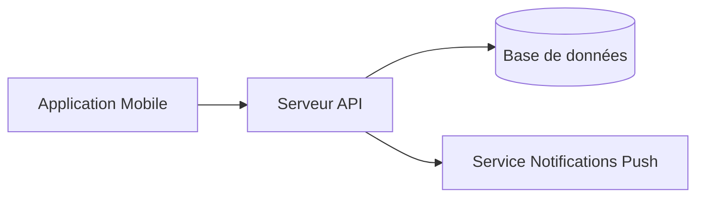
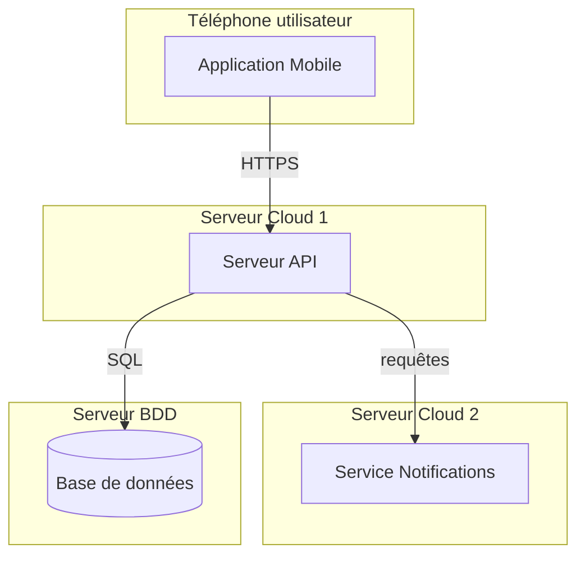

# Correction — Exercice 1

## Diagramme de composants

## Diagramme de déploiement

## Points clés à vérifier

- ✅ Dans le diagramme de composants, on ne précise **pas** où tournent les éléments — seulement leurs dépendances logiques
- ✅ Dans le diagramme de déploiement, chaque composant est bien placé dans un nœud physique distinct (serveur/téléphone)
- ✅ Le service de notifications est appelé par le serveur API, pas directement par le mobile (cohérent avec l'énoncé)
