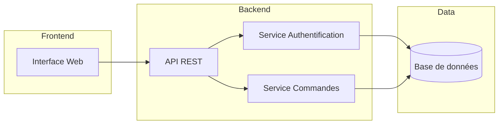
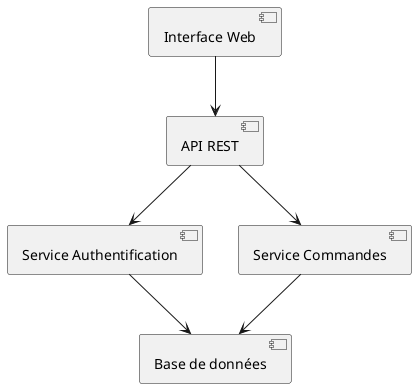
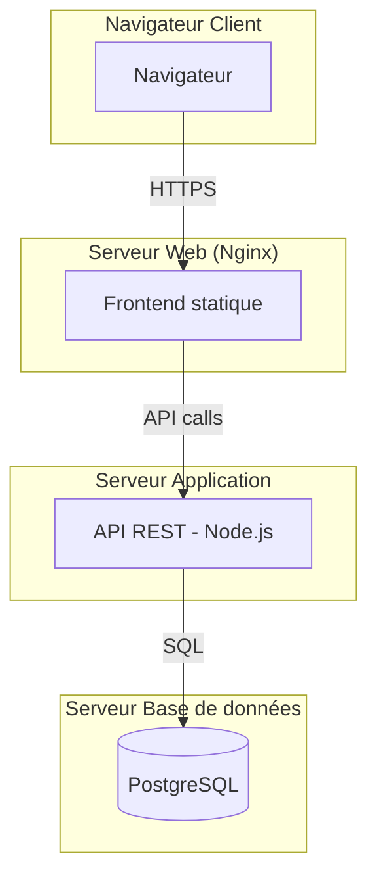
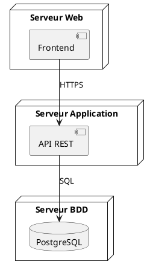

# 07 - Diagrammes de composants & de déploiement

Deux diagrammes structurels moins fréquents au quotidien, mais utiles pour documenter l'architecture technique d'un système.

## Diagramme de composants

Montre comment le système est découpé en **modules/composants logiciels** et leurs dépendances (via des interfaces).

### Notation PlantUML dédiée

## Diagramme de déploiement

Montre la **répartition physique** des composants logiciels sur des machines/serveurs/conteneurs.

### Notation PlantUML dédiée (avec nœuds physiques)

## Quand les utiliser ?

- **Composants** : pour documenter une architecture logicielle (microservices, modules) — utile dans une doc d'architecture technique
- **Déploiement** : pour documenter l'infrastructure (serveurs, cloud, conteneurs Docker/Kubernetes) — utile pour les équipes DevOps/Ops

## À retenir

- Composants = **logique** (qui dépend de qui dans le code)
- Déploiement = **physique** (qui tourne où)
- Moins utilisés que classes/séquence au quotidien, mais essentiels pour documenter une architecture système complète
