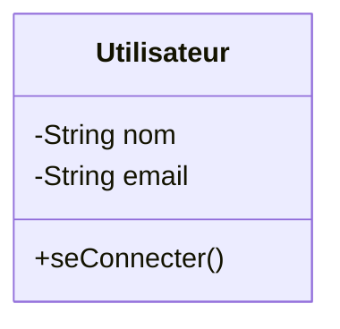

# 01 - Introduction à UML

## C'est quoi UML ?

**UML** (Unified Modeling Language) est un langage de modélisation graphique normalisé. Il sert à **représenter visuellement** la structure et le comportement d'un système logiciel.

Ce n'est **pas** un langage de programmation : c'est un outil de communication et de conception.

## Pourquoi utiliser UML ?

- Communiquer une architecture entre développeurs
- Concevoir avant de coder
- Documenter un système existant
- Faciliter la maintenance

## Les deux grandes familles

### 1. Diagrammes structurels (statiques)

| Diagramme | Utilité |
|---|---|
| Classes | Structure du code |
| Composants | Organisation en modules |
| Déploiement | Répartition physique |

### 2. Diagrammes comportementaux (dynamiques)

| Diagramme | Utilité |
|---|---|
| Cas d'utilisation | Fonctionnalités vues par les utilisateurs |
| Séquence | Échanges de messages dans le temps |
| Activité | Flux / algorithme / processus métier |
| États | Cycle de vie d'un objet |

## Quand utiliser quel diagramme ?

- Structure du code → **Diagramme de classes**
- Ce qu'un utilisateur peut faire → **Cas d'utilisation**
- Comment des objets interagissent → **Séquence**
- Un algorithme / processus → **Activité**
- Les états possibles d'un objet → **États**

## Exemple rapide (Mermaid)

## À retenir

- UML = langage de modélisation, pas de programmation
- 2 familles : structurel vs comportemental
- Le bon diagramme dépend de **ce que tu veux montrer**
