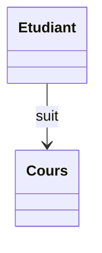
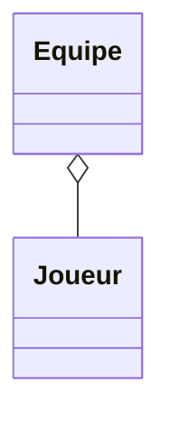
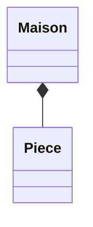
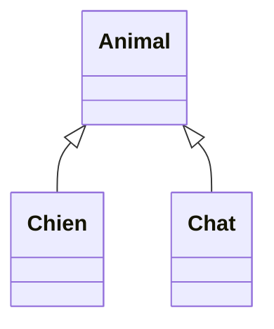
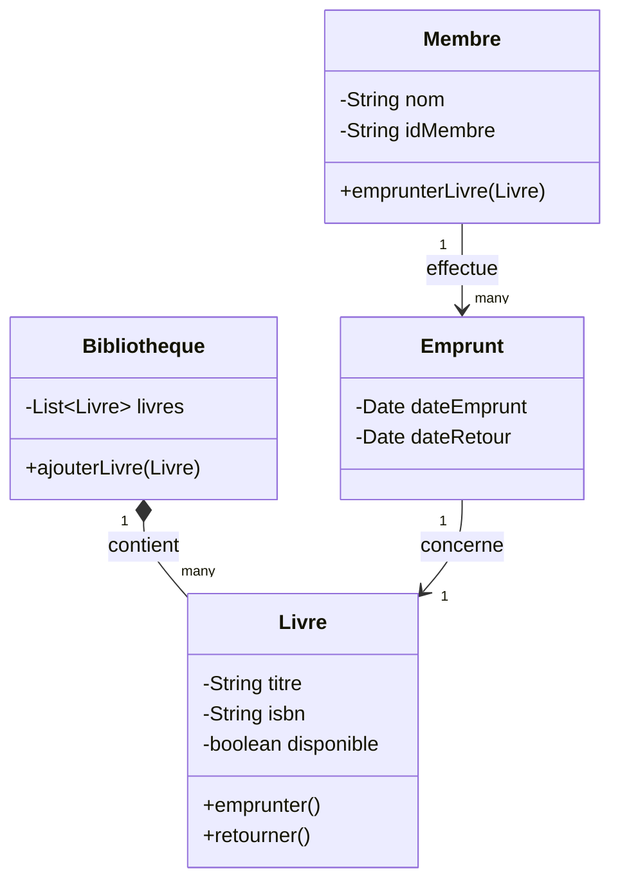

# 02 - Diagramme de classes

Le diagramme le plus utilisé en UML. Il décrit la **structure statique** : classes, attributs, méthodes et relations.

## Anatomie d'une classe

```
┌─────────────────────┐
│      NomClasse       │   ← nom
├─────────────────────┤
│ - attribut: Type     │   ← attributs
├─────────────────────┤
│ + methode(): Type    │   ← méthodes
└─────────────────────┘
```

### Visibilité

| Symbole | Signification |
|---|---|
| `+` | public |
| `-` | private |
| `#` | protected |

## Les relations

### Association


### Agrégation (losange vide) — "a un" faible


### Composition (losange plein) — "a un" forte


### Héritage — "est un"


### Tableau récapitulatif

| Relation | Mermaid | Sens |
|---|---|---|
| Association | `-->` | "utilise" |
| Agrégation | `o--` | "a un" faible |
| Composition | `*--` | "a un" forte |
| Héritage | `<|--` | "est un" |

## Exemple complet : bibliothèque



Voir aussi : [`exemples/bibliotheque.puml`](./exemples/bibliotheque.puml)

## Cardinalités

| Notation | Signification |
|---|---|
| `1` | exactement un |
| `0..1` | zéro ou un |
| `*` | zéro ou plusieurs |
| `1..*` | un ou plusieurs |

## À retenir

- Bien distinguer **agrégation** (faible) vs **composition** (forte)
- Toujours réfléchir aux cardinalités
