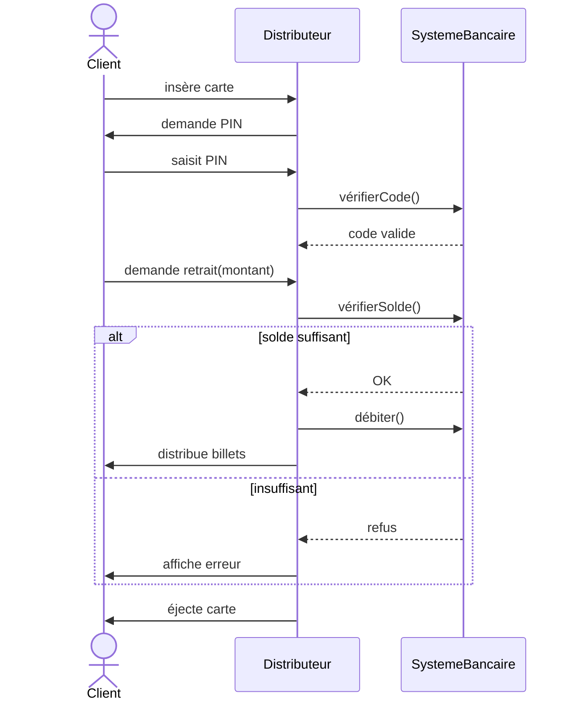

# Exemple : retrait au distributeur

```mermaid
sequenceDiagram
    actor Client
    participant Distributeur
    participant SystemeBancaire

    Client->>Distributeur: insère carte
    Distributeur->>Client: demande PIN
    Client->>Distributeur: saisit PIN
    Distributeur->>SystemeBancaire: vérifierCode()
    SystemeBancaire-->>Distributeur: code valide

    Client->>Distributeur: demande retrait(montant)
    Distributeur->>SystemeBancaire: vérifierSolde()

    alt solde suffisant
        SystemeBancaire-->>Distributeur: OK
        Distributeur->>SystemeBancaire: débiter()
        Distributeur->>Client: distribue billets
    else insuffisant
        SystemeBancaire-->>Distributeur: refus
        Distributeur->>Client: affiche erreur
    end

    Distributeur->>Client: éjecte carte
```
