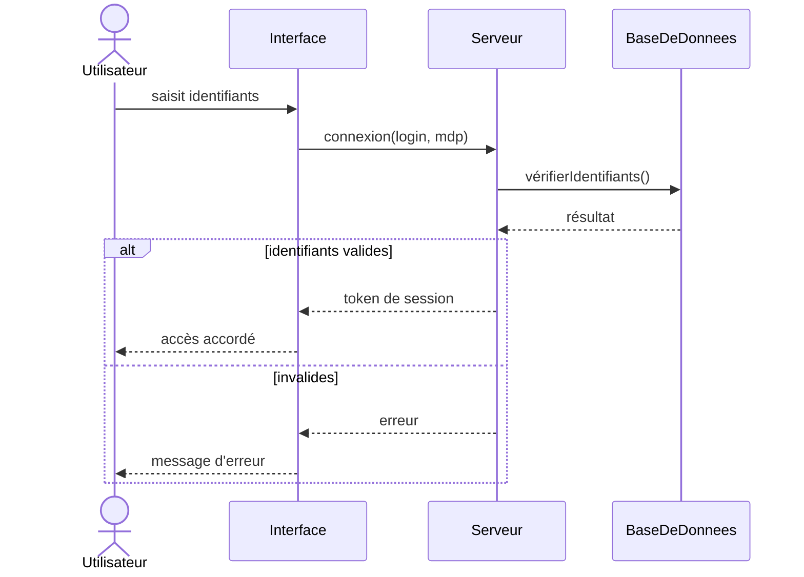

# 03 - Diagramme de séquence

Décrit **les échanges de messages entre objets/acteurs dans le temps**.

## Éléments clés

- **Acteur / Objet** : participant avec une ligne de vie verticale (pointillé)
- **Message** : flèche horizontale
  - flèche pleine `→` : appel synchrone
  - flèche pointillée `-->` : retour de réponse
- **Blocs combinés** : `alt`, `opt`, `loop`

## Exemple : connexion utilisateur

Voir aussi : [`exemples/connexion.puml`](./exemples/connexion.puml)

## Les blocs combinés

| Bloc | Usage |
|---|---|
| `alt / else` | condition (if / else) |
| `opt` | bloc optionnel |
| `loop` | répétition |

## À retenir

- Le temps s'écoule **de haut en bas**
- Flèches pleines = appels, pointillées = retours
- Utile pour documenter un cas d'utilisation précis
