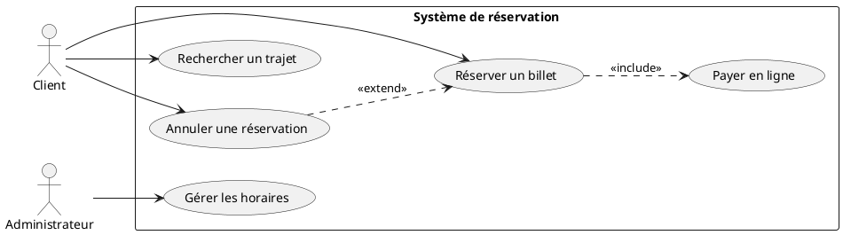

# 04 - Diagramme de cas d'utilisation

Décrit **les fonctionnalités du système vues par les utilisateurs (acteurs)**.

## Éléments clés

- **Acteur** : personne ou système externe (bonhomme)
- **Cas d'utilisation** : fonctionnalité (ellipse, nom = verbe à l'infinitif)
- **Système** : rectangle englobant
- **Relations** :
  - `<<include>>` : un cas **inclut systématiquement** un autre (obligatoire)
  - `<<extend>>` : un cas **peut optionnellement** en déclencher un autre

## Exemple : réservation de billets (PlantUML)

Voir aussi : [`exemples/reservation-billets.puml`](./exemples/reservation-billets.puml)

## Include vs Extend

- **`<<include>>`** = obligatoire, toujours déclenché
- **`<<extend>>`** = optionnel, conditionnel

> 💡 Mnémotechnique : *include = obligatoire*, *extend = optionnel*

## À retenir

- Nommer les cas d'utilisation avec un **verbe à l'infinitif**
- Ne pas mettre de détail technique ici (c'est le rôle du diagramme de séquence)
- Ne pas confondre acteur (externe) avec une classe du système
