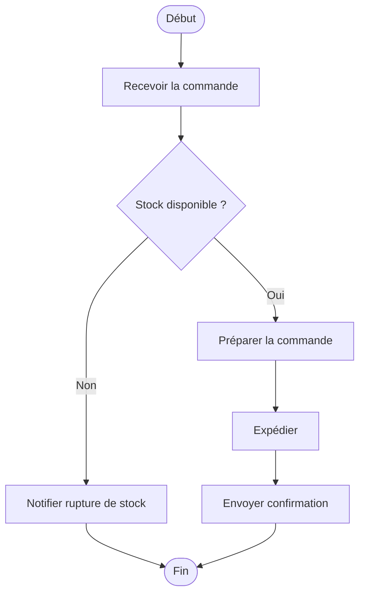
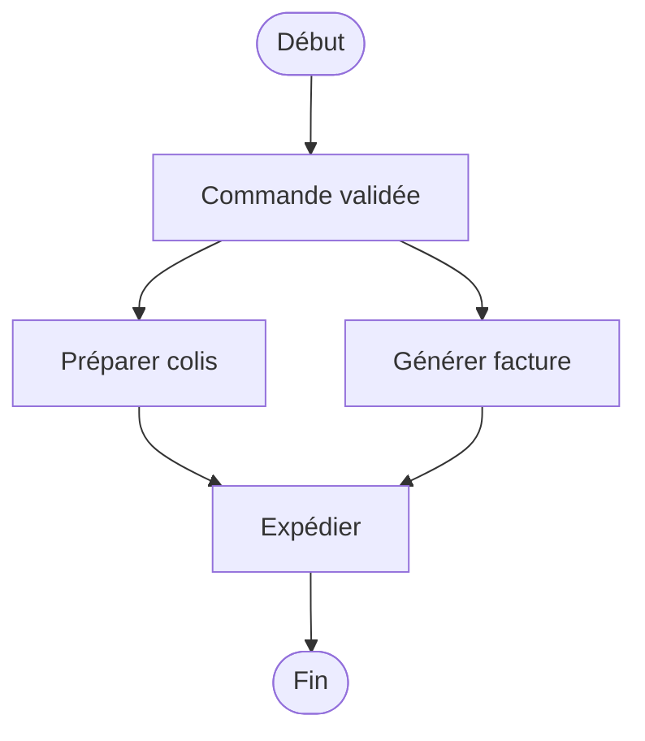

# 05 - Diagramme d'activité

Décrit **un flux/algorithme/processus métier**, étape par étape.

## Éléments clés

| Élément | Représentation |
|---|---|
| Début | rond noir plein |
| Fin | rond noir cerclé |
| Action | rectangle arrondi |
| Décision | losange |
| Fork/Join | barre noire (parallélisme) |

## Exemple : traitement d'une commande

Voir aussi : [`exemples/traitement-commande.puml`](./exemples/traitement-commande.puml)

## Exemple avec parallélisme

## À retenir

- Très lisible pour des non-techniques
- Le losange = toujours une décision (conditions sur les flèches)
- Utilise des **couloirs (swimlanes)** si plusieurs acteurs sont impliqués
