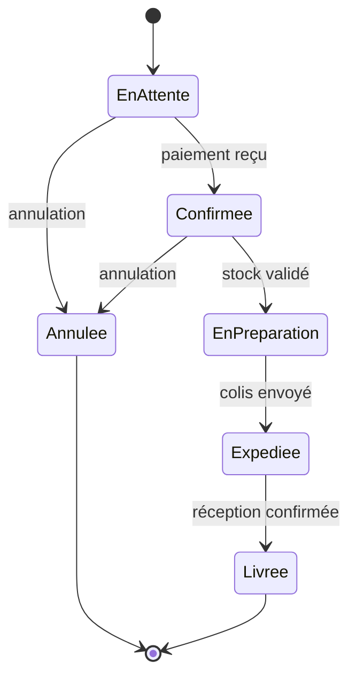

# 06 - Diagramme d'états

Décrit **le cycle de vie d'un objet** : ses états possibles et les transitions entre eux.

## Éléments clés

- **État** : rectangle aux coins arrondis
- **État initial** : rond noir plein
- **État final** : rond noir cerclé
- **Transition** : flèche étiquetée par l'événement déclencheur

## Exemple : cycle de vie d'une commande

Voir aussi : [`exemples/cycle-commande.puml`](./exemples/cycle-commande.puml)

## Diagramme d'états vs d'activité

| | États | Activité |
|---|---|---|
| Centré sur | **un objet** et ses états | **un processus** global |
| Question | "dans quel état est cet objet ?" | "quelles sont les étapes ?" |

## À retenir

- Toujours partir d'un **état initial** et finir sur un **état final**
- Les transitions sont déclenchées par un **événement**
- Ne pas confondre avec le diagramme d'activité
