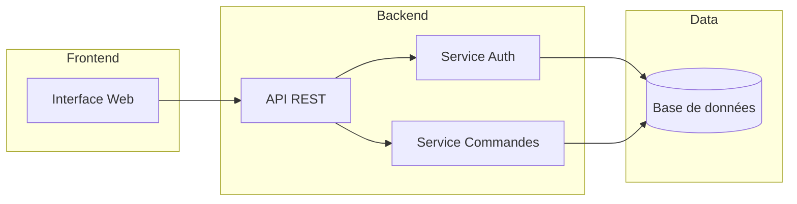
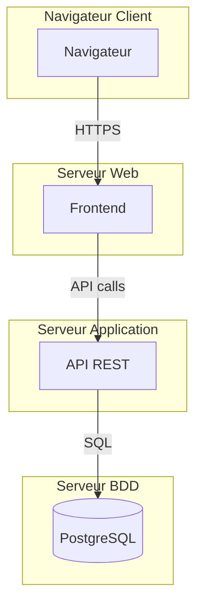

# 07 - Diagrammes de composants & de déploiement

## Diagramme de composants

Montre comment le système est découpé en **modules logiciels** et leurs dépendances.

Voir aussi : [`exemples/architecture-composants.puml`](./exemples/architecture-composants.puml)

## Diagramme de déploiement

Montre la **répartition physique** des composants sur des serveurs/machines.

## Quand les utiliser ?

- **Composants** → architecture logicielle (microservices, modules)
- **Déploiement** → infrastructure (serveurs, cloud, Docker)

## À retenir

- Composants = **logique** (qui dépend de qui)
- Déploiement = **physique** (qui tourne où)
